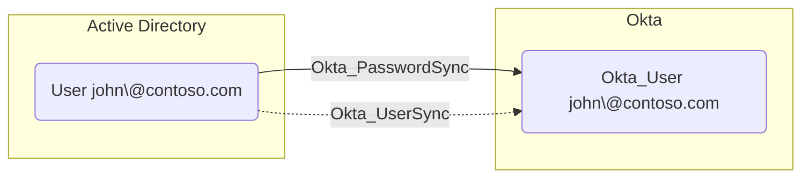
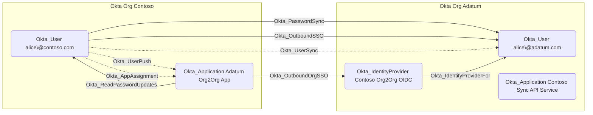

## General Information

The traversable Okta_PasswordSync edge represents password synchronization between user accounts. This indicates that credentials are synchronized from a source user to a target user.

In **Active Directory** hybrid setups, this edge is created between User (AD) and Okta_User when delegated authentication or password push is enabled. In **Org2Org** setups, this edge is created between Okta_User nodes across organizations when password synchronization is configured.

> [!WARNING]
> The Okta API does not indicate if the actual password or a randomly generated value is pushed to the other organization.

### Active Directory Hybrid


```mermaid
graph LR
    subgraph ad["Active Directory"]
        adu1("User john\@contoso.com")
    end
    subgraph okta["Okta"]
        u1("Okta_User john\@contoso.com")
        adu1 -->|Okta_PasswordSync| u1
        adu1 .->|Okta_UserSync| u1
    end
```

### Org2Org


```mermaid
graph LR
    subgraph source_org["Okta Org Contoso"]
        u1("Okta_User alice\@contoso.com")
        app1("Okta_Application Adatum Org2Org App")
    end
    subgraph target_org["Okta Org Adatum"]
        u2("Okta_User alice\@adatum.com")
        idp2("Okta_IdentityProvider Contoso Org2Org OIDC")
        app2("Okta_Application Contoso Sync API Service")
    end
    u1 -->|Okta_PasswordSync| u2
    u1 -->|Okta_OutboundSSO| u2
    u1 .->|Okta_UserSync| u2
    u1 .->|Okta_UserPush| app1
    u1 .->|Okta_AppAssignment| app1
    app1 -->|Okta_ReadPasswordUpdates| u1
    app1 -->|Okta_OutboundOrgSSO| idp2
    idp2 -->|Okta_IdentityProviderFor| u2
```

## Abuse Info

An attacker who controls the source user can influence the destination user's password path. When the edge represents delegated authentication or "Sync Okta Password", the attacker can set the source password to a known value and then authenticate as the destination user after synchronization. When the integration is configured to push a random password or password-cycle value, the edge may allow disruption or password rotation but may not reveal a reusable destination password.

OpenHound currently emits this edge for synchronized Active Directory application users and Okta Org2Org users. The practical abuse depends on the direction:

1. `AD User -> Okta_User`: the AD integration has delegated authentication. Control of the AD source password lets the attacker sign in to the destination Okta user because Okta sends the username and password to the AD agent and AD domain controller for validation.
2. `Okta_User -> AD User`: Okta is configured to push password updates to AD. Control of the Okta source password can update the destination AD password when Sync Password is enabled.
3. `Okta_User -> Okta_User`: an Org2Org integration is configured to push password updates from the source org to the connected destination org. This does not apply to federated users in the connected org.

Using Admin Console or source-system console:

1. Identify the source and destination node types and confirm the direction of the edge in BloodHound.
2. For `AD User -> Okta_User`, use the AD Users and Computers console, PowerShell, or another authorized AD password reset path to set the AD source user's password to a value known to the attacker. Because delegated authentication validates Okta sign-ins against AD, the destination Okta user can authenticate with that AD password.
3. For `Okta_User -> AD User`, sign in as the source Okta user and change the Okta password, or use an admin path over that source user to initiate a reset. The AD integration must have Sync Password enabled under **Directory** > **Directory Integrations** > **Active Directory** > **Provisioning** > **To App**.
4. For `Okta_User -> Okta_User`, sign in as the source Okta user in the source org and change the password, or use an admin path over that source user to initiate a reset. The Org2Org app must have push password updates enabled.
5. For application password sync paths, confirm whether the app is configured for **Sync Okta Password**, random password sync, or password-cycle sync. If the app uses random password or password-cycle mode, do not assume the destination password equals the source password.
6. Attempt to sign in as the destination account with the known password only when the configuration pushes the actual source password or delegates authentication to the source.
7. If MFA blocks the destination sign-in, combine this edge with `Okta_ResetFactors`, `Okta_HelpDeskAdmin`, a trusted device/factor path, or an application-specific path that accepts password-only authentication.

Using Active Directory PowerShell for an AD source:

1. Set the AD account identifiers and the attacker-known password.

    ```bash
    export AD_SOURCE_SAM="john"
    export KNOWN_PASSWORD='CorrectHorseBatteryStaple!42'
    ```

2. Reset the AD source user's password from a host with the Active Directory PowerShell module.

    ```powershell
    $User = $env:AD_SOURCE_SAM
    $Password = ConvertTo-SecureString $env:KNOWN_PASSWORD -AsPlainText -Force
    Set-ADAccountPassword -Identity $User -Reset -NewPassword $Password
    Unlock-ADAccount -Identity $User
    ```

3. Verify the AD account is usable.

    ```powershell
    Get-ADUser -Identity $env:AD_SOURCE_SAM -Properties Enabled,LockedOut,PasswordLastSet |
      Select-Object SamAccountName,Enabled,LockedOut,PasswordLastSet
    ```

4. Sign in to the destination Okta user with the known AD password. For delegated authentication, Okta sends the attempted password to the AD agent and domain controller during sign-in, so there is no separate Okta password push job to wait for.

Using the Okta API for an Okta source:

1. Set source-org, destination-org, user, and app variables. Use the same org for `DEST_OKTA_ORG` when the destination user is in the same tenant; use the connected tenant for Org2Org.

    ```bash
    export OKTA_ORG="https://source.okta.com"
    export OKTA_API_TOKEN="REDACTED"
    export SOURCE_USER_ID="00u_source..."
    export PASSWORD_SYNC_APP_ID="0oa_org2org_or_ad_app..."

    export DEST_OKTA_ORG="https://target.okta.com"
    export DEST_OKTA_API_TOKEN="REDACTED"
    export DESTINATION_USER_ID="00u_destination..."
    ```

2. Confirm the source app-user assignment is synchronized. This tells you the edge is tied to an application-user record that Okta considers in sync.

    ```bash
    curl -sS \
      -H "Authorization: SSWS $OKTA_API_TOKEN" \
      -H "Accept: application/json" \
      "$OKTA_ORG/api/v1/apps/$PASSWORD_SYNC_APP_ID/users/$SOURCE_USER_ID" \
      | jq '{id, scope, status, syncState, lastUpdated, passwordChanged}'
    ```

3. Generate a password reset link for the source Okta user. The Management API returns a one-time reset URL when `sendEmail=false`; complete that URL in a browser or automation harness to set the source password to the attacker-known value.

    ```bash
    RESET_URL="$(curl -sS -X POST \
      -H "Authorization: SSWS $OKTA_API_TOKEN" \
      -H "Accept: application/json" \
      "$OKTA_ORG/api/v1/users/$SOURCE_USER_ID/lifecycle/reset_password?sendEmail=false&revokeSessions=false" \
      | jq -r '.resetPasswordUrl')"

    printf '%s\n' "$RESET_URL"
    ```

4. Verify the source user's password timestamp changed after the reset flow is completed.

    ```bash
    curl -sS \
      -H "Authorization: SSWS $OKTA_API_TOKEN" \
      -H "Accept: application/json" \
      "$OKTA_ORG/api/v1/users/$SOURCE_USER_ID" \
      | jq '{id, status, lastLogin, passwordChanged}'
    ```

5. Check the app-user synchronization state again. For password-push paths, wait until the app-user record is synchronized or until the downstream app/directory shows the password update.

    ```bash
    curl -sS \
      -H "Authorization: SSWS $OKTA_API_TOKEN" \
      -H "Accept: application/json" \
      "$OKTA_ORG/api/v1/apps/$PASSWORD_SYNC_APP_ID/users/$SOURCE_USER_ID" \
      | jq '{id, status, syncState, lastUpdated, passwordChanged}'
    ```

6. Verify the destination user still exists and is active before attempting authentication.

    ```bash
    curl -sS \
      -H "Authorization: SSWS $DEST_OKTA_API_TOKEN" \
      -H "Accept: application/json" \
      "$DEST_OKTA_ORG/api/v1/users/$DESTINATION_USER_ID" \
      | jq '{id, status, profile: {login: .profile.login}, lastLogin, passwordChanged}'
    ```

    The Management API does not safely verify a plaintext password. Verify the final access path by attempting an interactive sign-in or downstream authentication as the destination user with the known password, then observe whether MFA, sign-on policy, or downstream policy blocks access. If using OAuth instead of an SSWS API token for the API calls above, replace the authorization header with `Authorization: Bearer $OKTA_ACCESS_TOKEN`.

## Cleanup after Abuse

Cleanup replaces the attacker-known source password with a legitimate reset, lets the same password sync or delegated-auth path update the destination, removes attacker-added authenticators, and revokes sessions created with the synchronized credential.

Cleanup using Admin Console:

1. Identify whether cleanup must start in AD, the source Okta org, or the source Org2Org application.
2. For AD-to-Okta delegated authentication, reset the source AD user's password through normal AD administration and ensure the destination Okta user can no longer authenticate with the attacker-known password.
3. For Okta-to-AD password push, reset the source Okta user's password legitimately, then have the user complete the flow that causes Okta to push the current password to AD.
4. For Org2Org password push, reset the source Okta user's password legitimately and wait for the connected org application to push the update to the destination org.
5. Remove attacker-enrolled authenticators from the destination user and restore any authenticators removed during the operation.
6. Revoke source and destination sessions created with the attacker-known password.
7. Verify the destination account no longer accepts the attacker-known password and that the relevant provisioning task has returned to a healthy state.

Cleanup using API:

1. Reset the source password through the authoritative source. For an AD source, use AD tooling and force a legitimate password reset.

    ```powershell
    $User = $env:AD_SOURCE_SAM
    $LegitimateTempPassword = "REPLACE_WITH_APPROVED_TEMP_PASSWORD"
    $Password = ConvertTo-SecureString $LegitimateTempPassword -AsPlainText -Force
    Set-ADAccountPassword -Identity $User -Reset -NewPassword $Password
    Set-ADUser -Identity $User -ChangePasswordAtLogon $true
    ```

2. For an Okta source user, generate a legitimate reset link and revoke the source user's current sessions. Deliver the reset URL through an approved recovery channel, or change `sendEmail=false` to `sendEmail=true` if Okta should email the reset link directly.

    ```bash
    RESET_URL="$(curl -sS -X POST \
      -H "Authorization: SSWS $OKTA_API_TOKEN" \
      -H "Accept: application/json" \
      "$OKTA_ORG/api/v1/users/$SOURCE_USER_ID/lifecycle/reset_password?sendEmail=false&revokeSessions=true" \
      | jq -r '.resetPasswordUrl')"

    printf '%s\n' "$RESET_URL"
    ```

3. Wait for password push or delegated-auth state to converge, then verify the app-user sync record is healthy.

    ```bash
    curl -sS \
      -H "Authorization: SSWS $OKTA_API_TOKEN" \
      -H "Accept: application/json" \
      "$OKTA_ORG/api/v1/apps/$PASSWORD_SYNC_APP_ID/users/$SOURCE_USER_ID" \
      | jq '{id, status, syncState, lastUpdated, passwordChanged}'
    ```

4. List destination factors and identify any attacker-controlled enrollment.

    ```bash
    curl -sS \
      -H "Authorization: SSWS $DEST_OKTA_API_TOKEN" \
      -H "Accept: application/json" \
      "$DEST_OKTA_ORG/api/v1/users/$DESTINATION_USER_ID/factors" \
      | jq -r '.[] | [.id, .factorType, .provider, .status, (.profile.email // .profile.phoneNumber // "")] | @tsv'
    ```

5. Remove each attacker-controlled factor by ID.

    ```bash
    export ATTACKER_FACTOR_ID="opf_or_sms_or_totp..."

    curl -i -sS -X DELETE \
      -H "Authorization: SSWS $DEST_OKTA_API_TOKEN" \
      -H "Accept: application/json" \
      "$DEST_OKTA_ORG/api/v1/users/$DESTINATION_USER_ID/factors/$ATTACKER_FACTOR_ID"
    ```

    A successful factor removal returns `204 No Content`.

6. Revoke source and destination Okta sessions and OAuth/OIDC tokens.

    ```bash
    curl -i -sS -X DELETE \
      -H "Authorization: SSWS $OKTA_API_TOKEN" \
      -H "Accept: application/json" \
      "$OKTA_ORG/api/v1/users/$SOURCE_USER_ID/sessions?oauthTokens=true"

    curl -i -sS -X DELETE \
      -H "Authorization: SSWS $DEST_OKTA_API_TOKEN" \
      -H "Accept: application/json" \
      "$DEST_OKTA_ORG/api/v1/users/$DESTINATION_USER_ID/sessions?oauthTokens=true"
    ```

7. Confirm the destination user no longer has attacker-controlled factors and remains in the expected lifecycle state.

    ```bash
    curl -sS \
      -H "Authorization: SSWS $DEST_OKTA_API_TOKEN" \
      -H "Accept: application/json" \
      "$DEST_OKTA_ORG/api/v1/users/$DESTINATION_USER_ID" \
      | jq '{id, status, profile: {login: .profile.login}, lastLogin, passwordChanged}'

    curl -sS \
      -H "Authorization: SSWS $DEST_OKTA_API_TOKEN" \
      -H "Accept: application/json" \
      "$DEST_OKTA_ORG/api/v1/users/$DESTINATION_USER_ID/factors" \
      | jq -r '.[] | [.id, .factorType, .provider, .status] | @tsv'
    ```

8. Attempt to sign in as the destination account with the attacker-known password and verify it fails. For AD destinations, also verify the AD password state with directory tooling.

## Opsec Considerations

Password sync abuse leaves activity in the authoritative source and in Okta. Relevant Okta System Log event types include `user.account.update_password`, `user.account.reset_password`, `application.user_membership.change_password`, `application.provision.user.sync`, `user.authentication.auth_via_AD_agent`, and `user.session.start`.

AD-to-Okta abuse also creates domain controller authentication and password reset/change logs. Okta-to-AD and Org2Org abuse may create provisioning task failures if the destination password policy rejects the pushed password. A password change followed immediately by a destination sign-in from a new network, or by factor enrollment/reset activity, is a strong detection chain.

## References

- [Okta delegated authentication with Active Directory](https://help.okta.com/en-us/Content/Topics/Directory/Directory_AD_Delegated_Authentication.htm)
- [Okta synchronize passwords from Okta to Active Directory](https://help.okta.com/en-us/content/topics/directory/security_using_sync_password.htm)
- [Okta password synchronization use cases](https://help.okta.com/en-us/content/topics/directory/password-sync-use-cases.htm)
- [Okta application password synchronization](https://help.okta.com/en-us/content/topics/directory/password-sync-application.htm)
- [Okta Org2Org supported features](https://help.okta.com/oie/en-us/content/topics/provisioning/org2org/org2org-supported-features.htm)
- [Okta User Credentials API: Reset a password](https://developer.okta.com/docs/api/openapi/okta-management/management/tag/UserCred/#tag/UserCred/operation/resetPassword)
- [Okta Application Users API: Retrieve an application user](https://developer.okta.com/docs/api/openapi/okta-management/management/tag/ApplicationUsers/#tag/ApplicationUsers/operation/getApplicationUser)
- [Okta User Factors API: List enrolled factors](https://developer.okta.com/docs/api/openapi/okta-management/management/tag/UserFactor/#tag/UserFactor/operation/listFactors)
- [Okta User Factors API: Unenroll a factor](https://developer.okta.com/docs/api/openapi/okta-management/management/tag/UserFactor/#tag/UserFactor/operation/unenrollFactor)
- [Okta User Sessions API: Revoke all user sessions](https://developer.okta.com/docs/api/openapi/okta-management/management/tag/UserSessions/#tag/UserSessions/operation/revokeUserSessions)
- [Okta SCIM concepts](https://developer.okta.com/docs/concepts/scim/)
- [Okta System Log event types](https://developer.okta.com/docs/reference/api/event-types/)
