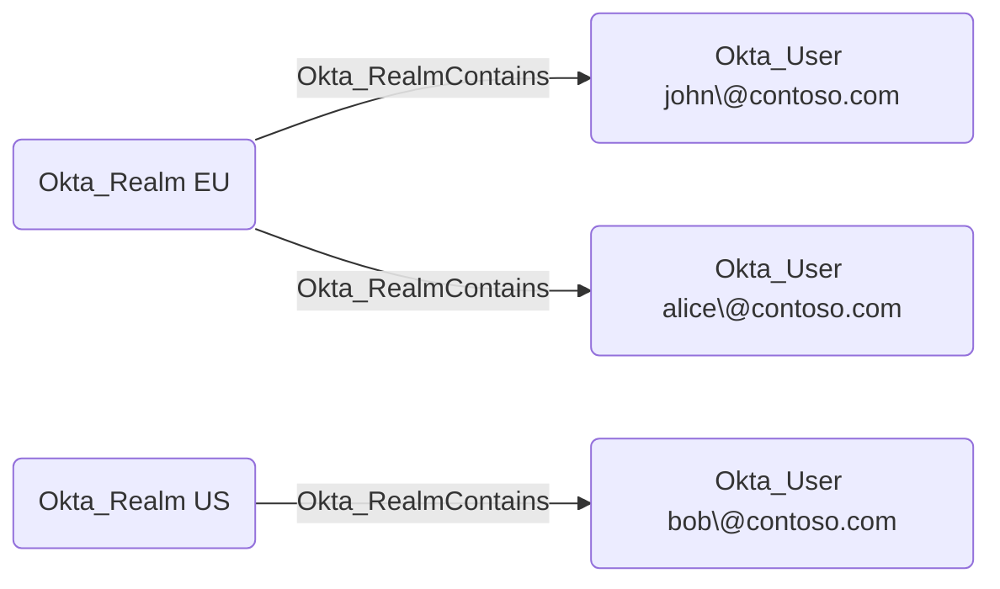

## General Information

The traversable Okta_RealmContains edges represent containment relationships between realms and the users assigned to those realms.

> [!NOTE]
> Okta Realms are currently not supported by BloodHound due to licensing restrictions.
