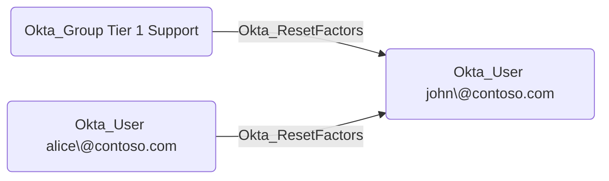

## General Information

The traversable Okta_ResetFactors edges represent custom role permissions that allow a principal to reset MFA authenticators for scoped Okta users. These edges are created when a custom role includes the `okta.users.credentials.resetFactors` or `okta.users.credentials.manage` permissions.

