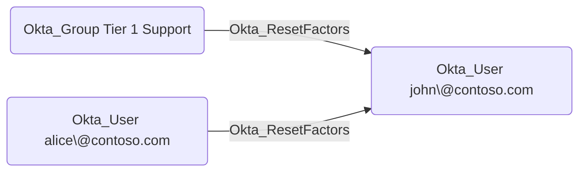

## General Information

The traversable Okta_ResetFactors edges represent custom role permissions that allow a principal to reset MFA authenticators for scoped Okta users. These edges are created when a custom role includes the `okta.users.credentials.resetFactors` or `okta.users.credentials.manage` permissions.


```mermaid
graph LR
        u1("Okta_User john\@contoso.com")
        u2("Okta_User alice\@contoso.com")
        g1("Okta_Group Tier 1 Support")
        g1 -- Okta_ResetFactors --> u1
        u2 -- Okta_ResetFactors --> u1
```

## Abuse Info

An attacker who controls the source principal can reset all enrolled authenticators for the destination user. By itself, this does not provide the user's password, but it removes the MFA barrier for password reset, password sync, known-password, session theft, or social-engineering paths. The edge may originate from a user, a group with the custom role assignment, or a service application/client with the custom admin role assignment.

For a user source, sign in to the Admin Console as that user. For a group source, compromise any member of the source group. For an application source, authenticate as the service app or client and use its management API access.

Using the Admin Console:

1. Authenticate to Okta as the source user, as a member of the source group, or as the source service application.
2. Open **Directory** > **People** and select the destination user from the edge.
3. Use the user action to reset the user's multifactor authentication or authenticators.
4. Obtain or set the user's password through another path, such as `Okta_ResetPassword`, `Okta_HelpDeskAdmin`, `Okta_PasswordSync`, credential theft, or password spraying.
5. Sign in as the destination user and enroll attacker-controlled authenticators when Okta prompts for re-enrollment.
6. Launch the user's applications or use their administrative access once the new authenticator is accepted.

Using the Okta API:

1. Set the Okta org URL, a token for the source principal, and the destination user ID.

    ```bash
    export OKTA_ORG="https://contoso.okta.com"
    export OKTA_API_TOKEN="REDACTED"
    export TARGET_USER_ID="00u..."
    ```

2. Confirm that the user currently has enrolled factors.

    ```bash
    curl -sS \
      -H "Authorization: SSWS $OKTA_API_TOKEN" \
      -H "Accept: application/json" \
      "$OKTA_ORG/api/v1/users/$TARGET_USER_ID/factors" \
      | jq -r '.[] | [.id, .factorType, .provider, .status] | @tsv'
    ```

3. Reset all enrolled factors for the destination user.

    ```bash
    curl -i -sS -X POST \
      -H "Authorization: SSWS $OKTA_API_TOKEN" \
      -H "Accept: application/json" \
      "$OKTA_ORG/api/v1/users/$TARGET_USER_ID/lifecycle/reset_factors"
    ```

4. Pair the reset with a password path and complete a new sign-in as the destination user.
5. Verify attacker enrollment by listing factors again after sign-in and checking for the new factor ID, provider, or device.

## Cleanup after Abuse

Cleanup removes attacker-controlled authenticators from the destination user, restores legitimate factor enrollment, and revokes sessions created after the factor reset.

Cleanup using Admin Console:

1. Open **Directory** > **People** and select the destination user.
2. Review the user's enrolled authenticators.
3. Remove attacker-controlled authenticators.
4. Require the user to re-enroll legitimate authenticators through the normal recovery process.
5. Clear active sessions created after the reset if they are no longer needed.

Cleanup using API:

1. List the factors enrolled after the reset and identify attacker-controlled enrollments.

    ```bash
    curl -sS \
      -H "Authorization: SSWS $OKTA_API_TOKEN" \
      -H "Accept: application/json" \
      "$OKTA_ORG/api/v1/users/$TARGET_USER_ID/factors"
    ```

2. Delete each attacker-controlled factor.

    ```bash
    curl -i -sS -X DELETE \
      -H "Authorization: SSWS $OKTA_API_TOKEN" \
      -H "Accept: application/json" \
      "$OKTA_ORG/api/v1/users/$TARGET_USER_ID/factors/$FACTOR_ID"
    ```

3. Revoke sessions, OAuth tokens, and remembered devices created during the abuse.

    ```bash
    curl -i -sS -X DELETE \
      -H "Authorization: SSWS $OKTA_API_TOKEN" \
      -H "Accept: application/json" \
      "$OKTA_ORG/api/v1/users/$TARGET_USER_ID/sessions?oauthTokens=true&forgetDevices=true"
    ```

4. Verify the factor list contains only expected authenticators after the legitimate user re-enrolls.

## Opsec Considerations

Authenticator resets, factor deletion, factor enrollment, remembered-device changes, and follow-on sign-ins are recorded in the Okta System Log. Relevant event types include `user.mfa.factor.reset_all`, `user.mfa.factor.deactivate`, `user.mfa.factor.activate`, `user.session.clear`, and `user.session.start`.

Resetting authenticators shortly before a password reset, login from a new device, or access to the Okta Admin Console is a strong account takeover indicator. The API path also records the caller, source IP, user agent, request URI, and target user.

## References

- [Okta User Lifecycle API: Reset the factors](https://developer.okta.com/docs/api/openapi/okta-management/management/tag/UserLifecycle/)
- [Okta User Factors API](https://developer.okta.com/docs/api/openapi/okta-management/management/tag/UserFactor/)
- [Okta User Sessions API](https://developer.okta.com/docs/api/openapi/okta-management/management/tag/UserSessions/)
- [Okta custom role permissions](https://developer.okta.com/docs/api/openapi/okta-management/guides/permissions/)
- [Okta System Log event types](https://developer.okta.com/docs/reference/api/event-types/)
- [Adam Chester: Okta for Red Teamers](https://blog.xpnsec.com/okta-for-redteamers/)
