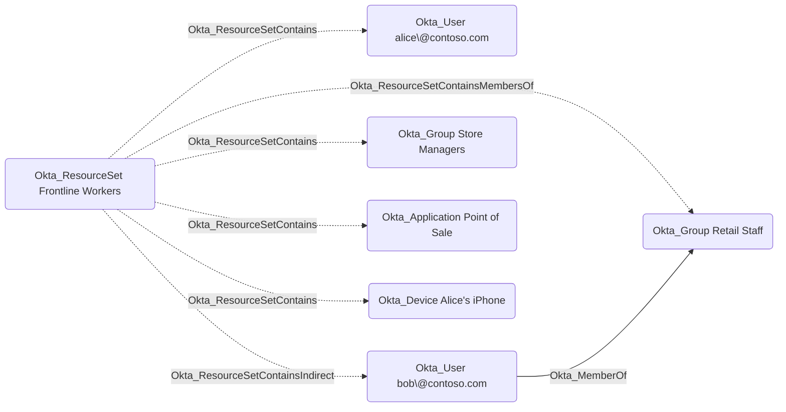

## General Information

The non-traversable Okta_ResourceSetContains edges represent the direct membership relationships between resource sets and their member entities in Okta:

```mermaid
graph LR
    rs1("Okta_ResourceSet Frontline Workers")
    u1("Okta_User alice\@contoso.com")
    u2("Okta_User bob\@contoso.com")
    g1("Okta_Group Store Managers")
    g2("Okta_Group Retail Staff")
    a1("Okta_Application Point of Sale")
    d1("Okta_Device Alice's iPhone")
    rs1 -. Okta_ResourceSetContains .-> u1
    rs1 -. Okta_ResourceSetContains .-> g1
    rs1 -. Okta_ResourceSetContains .-> a1
    rs1 -. Okta_ResourceSetContains .-> d1
    rs1 -. Okta_ResourceSetContainsMembersOf .-> g2
    u2 -- Okta_MemberOf --> g2
    rs1 -. Okta_ResourceSetContainsIndirect .-> u2
```

Resource sets can contain users, groups, applications, API service integrations, devices, authorization servers, identity providers, and policies. When a resource set contains a group, only the group object itself is in scope; its members are not.

Okta also allows a resource set to contain the members of a group instead of the group itself. Such memberships are represented by the [Okta_ResourceSetContainsMembersOf](Okta_ResourceSetContainsMembersOf.md) edge to the group and by [Okta_ResourceSetContainsIndirect](Okta_ResourceSetContainsIndirect.md) edges to the users who are members of that group. The union of Okta_ResourceSetContains and Okta_ResourceSetContainsIndirect edges therefore covers all objects that a role assignment scoped to the resource set applies to.

These edges are informational. The effective permissions granted by custom roles scoped to a resource set are represented by dedicated traversable edges, such as [Okta_ResetPassword](Okta_ResetPassword.md), [Okta_AddMember](Okta_AddMember.md), and [Okta_ManageApp](Okta_ManageApp.md).
