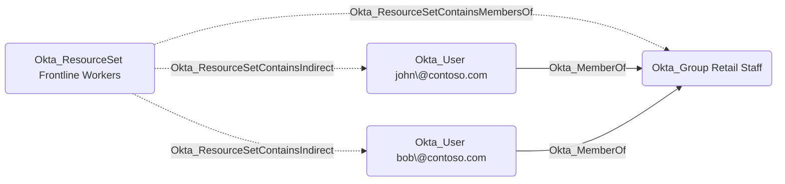

## General Information

The non-traversable Okta_ResourceSetContainsIndirect edges represent users that are members of a resource set indirectly through a group membership in Okta:

These edges are created when a resource set contains the members of a group, which is represented by the [Okta_ResourceSetContainsMembersOf](Okta_ResourceSetContainsMembersOf.md) edge. The collector resolves the current group membership and creates one Okta_ResourceSetContainsIndirect edge per member user. As a result, users who join or leave the group gain or lose the corresponding resource set membership, and thereby become or stop being targets of any custom role assignment scoped to the resource set.

Users that are added to a resource set directly are represented by the [Okta_ResourceSetContains](Okta_ResourceSetContains.md) edges. The union of Okta_ResourceSetContains and Okta_ResourceSetContainsIndirect edges covers all objects that a role assignment scoped to the resource set applies to.
