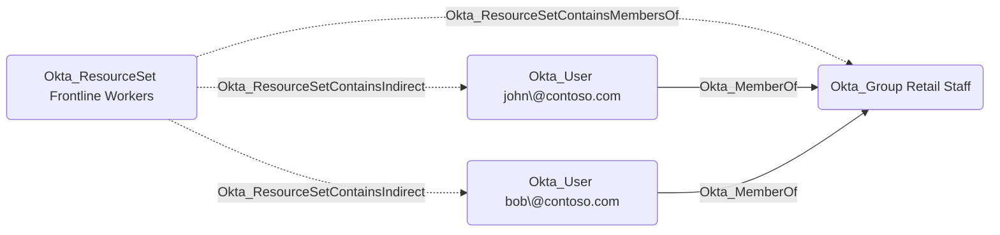

## General Information

The non-traversable Okta_ResourceSetContainsMembersOf edges represent resource sets that contain the members of a group in Okta, as opposed to the group object itself:

In the Okta Admin Console, this corresponds to adding a group to a resource set with the *Users in group* option instead of *Group*.

A custom role scoped to the resource set applies to the users who are members of the group, not to the group itself. For example, a Help Desk role scoped to this resource set can reset passwords of the group's members but cannot manage the group's membership. The individual users in scope are represented by the [Okta_ResourceSetContainsIndirect](Okta_ResourceSetContainsIndirect.md) edges, while directly contained objects are represented by the [Okta_ResourceSetContains](Okta_ResourceSetContains.md) edges.
