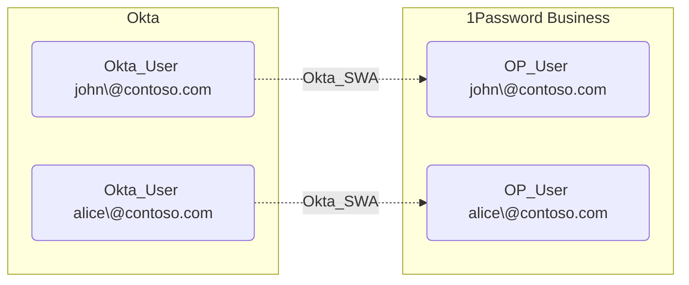

## General Information

The non-traversable hybrid Okta_SWA edges represent Secure Web Authentication relationships between Okta users and their linked accounts in external applications. SWA is not federation; Okta stores or submits application credentials on behalf of the user.


```mermaid
graph LR
    subgraph okta["Okta"]
        u1("Okta_User john\@contoso.com")
        u2("Okta_User alice\@contoso.com")
    end
    subgraph op["1Password Business"]
        opu1("OP_User john\@contoso.com")
        opu2("OP_User alice\@contoso.com")
    end
    u1 -. Okta_SWA .-> opu1
    u2 -. Okta_SWA .-> opu2
```

The edge is non-traversable because stored password submission is highly dependent on tenant settings, browser/plugin behavior, and the destination application's own login controls. In practice, control of the source Okta user often gives interactive access to the destination account even if the attacker never learns the stored password.

## Abuse Info

An attacker who controls the source Okta user can access the destination external account through SWA by launching the application from Okta and letting Okta fill or submit the stored credentials. If the attacker also controls the SWA app assignment or app-user credentials, they can set or replace the stored downstream password for the source user's assignment.

This differs from `Okta_OutboundSSO`: the destination application sees a password-based login, not a SAML/OIDC federated login. SWA can still be valuable because Okta may submit a credential the user or attacker does not know.

Using the Okta dashboard and browser plugin:

1. Obtain a valid Okta session for the source user.
2. Open the Okta end-user dashboard or Okta browser plugin.
3. Launch the SWA application represented by the edge.
4. Let Okta fill or submit the stored username and password to the destination application.
5. Use the resulting destination application session as the linked destination account.
6. If tenant and app settings allow password reveal or user-managed SWA credentials, capture the stored credential and test direct login to the destination application.
7. If MFA or device checks exist in the destination application, complete them or pivot to session/token theft inside that application.

Using the Okta API:

1. Set variables for the source Okta user, SWA app, and optional SWA credential values. Use the credential-setting steps only when you have app administration rights and are intentionally creating or restoring an app-user credential.

    ```bash
    export OKTA_ORG="https://contoso.okta.com"
    export OKTA_API_TOKEN="REDACTED"
    export SOURCE_USER_ID="00u..."
    export SWA_APP_ID="0oa..."
    export SWA_USERNAME="alice@example.com"
    export TEMP_SWA_PASSWORD="CorrectHorseBatteryStaple!23"
    ```

2. Confirm that the source application is an SWA-style app and save the app configuration.

    ```bash
    curl -sS \
      -H "Authorization: SSWS $OKTA_API_TOKEN" \
      -H "Accept: application/json" \
      "$OKTA_ORG/api/v1/apps/$SWA_APP_ID" \
      | tee /tmp/okta-swa-app-original.json \
      | jq '{id, label, name, status, signOnMode, url: .settings.app.url, credentials: .credentials.scheme}'
    ```

    SWA apps commonly use sign-on modes such as `SECURE_PASSWORD_STORE`, `BROWSER_PLUGIN`, or `AUTO_LOGIN`.

3. Verify the source user's SWA app assignment and app username.

    ```bash
    curl -sS \
      -H "Authorization: SSWS $OKTA_API_TOKEN" \
      -H "Accept: application/json" \
      "$OKTA_ORG/api/v1/apps/$SWA_APP_ID/users/$SOURCE_USER_ID" \
      | jq '{id, status, scope, credentials, profile}'
    ```

4. If you control the app assignment and need to set a temporary SWA password, update the application user credentials. Okta does not return the cleartext password after it is set.

    ```bash
    curl -sS -X POST \
      -H "Authorization: SSWS $OKTA_API_TOKEN" \
      -H "Accept: application/json" \
      -H "Content-Type: application/json" \
      -d "{\"credentials\":{\"userName\":\"$SWA_USERNAME\",\"password\":{\"value\":\"$TEMP_SWA_PASSWORD\"}}}" \
      "$OKTA_ORG/api/v1/apps/$SWA_APP_ID/users/$SOURCE_USER_ID" \
      | jq '{id, status, credentials, profile}'
    ```

5. Revoke the source user's Okta sessions if you need a clean browser flow, then re-authenticate and launch the SWA app.

    ```bash
    curl -i -sS -X DELETE \
      -H "Authorization: SSWS $OKTA_API_TOKEN" \
      -H "Accept: application/json" \
      "$OKTA_ORG/api/v1/users/$SOURCE_USER_ID/sessions?oauthTokens=true"
    ```

6. Complete the SWA launch in a browser. Okta's API can verify app assignment and app-user credential state, but the credential submission happens through the dashboard, plugin, or browser flow.

7. Verify the destination application session in the destination app's UI or API.

## Cleanup after Abuse

Cleanup for `Okta_SWA` means removing temporary SWA assignment or credential changes, rotating any exposed destination password, clearing Okta and downstream sessions, and removing browser artifacts created while Okta submitted the password.

Cleanup using Admin Console:

1. Open **Applications** > **Applications** and select the SWA application.
2. Restore the source user's app username and password settings if they were changed.
3. Remove the temporary app assignment if the source user was only assigned for the operation.
4. Rotate the destination application password if the SWA-stored credential was revealed, copied, or set to a temporary value.
5. Sign out of the destination application and revoke downstream sessions or tokens.
6. Remove temporary browser profiles, plugin state, saved passwords, screenshots, and captured credentials.
7. Verify the source user can no longer launch the SWA app or that the restored credential works only for the legitimate user.

Cleanup using API:

1. Restore the source user's SWA app credentials if you changed them. Use the legitimate replacement password or a password rotated in the destination application.

    ```bash
    export RESTORED_SWA_PASSWORD="REDACTED_RESTORED_PASSWORD"

    curl -sS -X POST \
      -H "Authorization: SSWS $OKTA_API_TOKEN" \
      -H "Accept: application/json" \
      -H "Content-Type: application/json" \
      -d "{\"credentials\":{\"userName\":\"$SWA_USERNAME\",\"password\":{\"value\":\"$RESTORED_SWA_PASSWORD\"}}}" \
      "$OKTA_ORG/api/v1/apps/$SWA_APP_ID/users/$SOURCE_USER_ID" \
      | jq '{id, status, credentials, profile}'
    ```

2. Remove the temporary SWA app assignment if one was created.

    ```bash
    curl -i -sS -X DELETE \
      -H "Authorization: SSWS $OKTA_API_TOKEN" \
      -H "Accept: application/json" \
      "$OKTA_ORG/api/v1/apps/$SWA_APP_ID/users/$SOURCE_USER_ID"
    ```

3. Revoke Okta sessions and OAuth tokens for the source user.

    ```bash
    curl -i -sS -X DELETE \
      -H "Authorization: SSWS $OKTA_API_TOKEN" \
      -H "Accept: application/json" \
      "$OKTA_ORG/api/v1/users/$SOURCE_USER_ID/sessions?oauthTokens=true"
    ```

4. Verify the app-user assignment state.

    ```bash
    curl -i -sS \
      -H "Authorization: SSWS $OKTA_API_TOKEN" \
      -H "Accept: application/json" \
      "$OKTA_ORG/api/v1/apps/$SWA_APP_ID/users/$SOURCE_USER_ID"
    ```

5. Use the destination application's API or admin UI to revoke password-based sessions and confirm the old password no longer works.

## Opsec Considerations

Okta System Log events can include `application.user_membership.show_password`, `application.user_membership.restore_password`, `application.user_membership.update`, app assignment events, `policy.evaluate_sign_on`, and app launch events such as `user.authentication.sso`. The destination application logs a password-based login rather than a federated login, often with the attacker's browser, IP address, and user agent.

SWA launches from a new device, password reveal events, app-user password changes, or direct destination logins shortly after a SWA launch are strong indicators. Browser artifacts can also expose the operation because SWA relies on interactive credential submission.

## References

- [Okta SWA app integrations](https://help.okta.com/oie/en-us/Content/Topics/Apps/apps-about-swa.htm)
- [Okta create SWA app integration guide](https://developer.okta.com/docs/guides/create-an-app-integration/swa/main/)
- [Okta Applications API](https://developer.okta.com/docs/api/openapi/okta-management/management/tag/Application/)
- [Okta Application Users API](https://developer.okta.com/docs/api/openapi/okta-management/management/tag/ApplicationUsers/)
- [Okta User Sessions API](https://developer.okta.com/docs/api/openapi/okta-management/management/tag/UserSessions/)
- [Okta System Log event types](https://developer.okta.com/docs/reference/api/event-types/)
- [Luke Jennings: Abusing Okta's SWA authentication method](https://pushsecurity.com/blog/okta-swa/)
