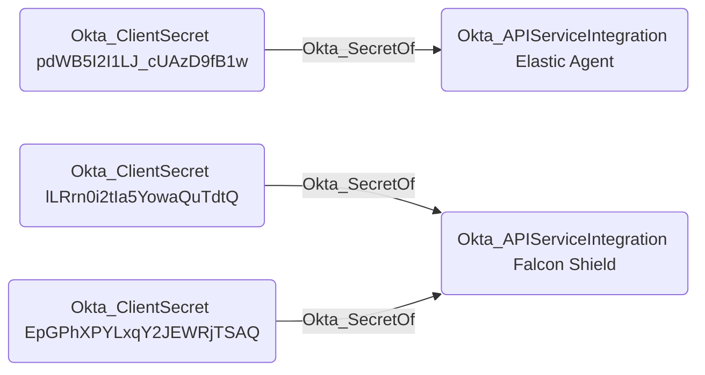

## General Information

The traversable Okta_SecretOf edges represent the relationship between service applications or API service integrations and their associated client secrets, represented by the Okta_ClientSecret nodes.

