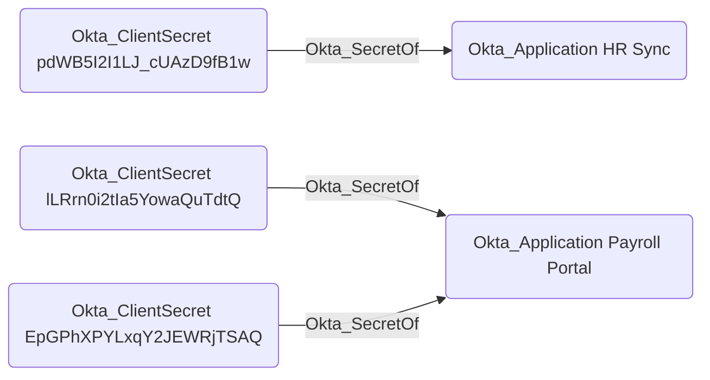

## General Information

The traversable Okta_SecretOf edges represent the relationship between OAuth client secrets and the Okta applications that own them. The collector emits this edge for `Okta_Application` records whose OAuth client authentication method is `client_secret_basic`.


```mermaid
graph LR
    app1("Okta_Application HR Sync")
    app2("Okta_Application Payroll Portal")
    cs1("Okta_ClientSecret pdWB5I2I1LJ_cUAzD9fB1w")
    cs2("Okta_ClientSecret lLRrn0i2tIa5YowaQuTdtQ")
    cs3("Okta_ClientSecret EpGPhXPYLxqY2JEWRjTSAQ")
    cs1 -- Okta_SecretOf --> app1
    cs2 -- Okta_SecretOf --> app2
    cs3 -- Okta_SecretOf --> app2
```

The `Okta_ClientSecret` node name is a secret hash, not the raw client secret value. The edge tells you which application a client secret belongs to and where a recovered secret can be used.

## Abuse Info

An attacker who obtains the raw source client secret can authenticate as the destination `Okta_Application` when that application uses client-secret authentication. This edge is directly abusable only when the attacker has the cleartext `client_secret` value and the application client ID. The graph relationship alone is not enough to authenticate.

For this collector, `Okta_SecretOf` is emitted for applications with `client_secret_basic`; the practical abuse path is to send the client ID and client secret in HTTP Basic authentication to the correct Okta authorization server token endpoint. The resulting access token acts as the destination application and carries the scopes and downstream privileges granted to that client.

Using the Admin Console:

1. Identify the destination application from the `Okta_SecretOf` edge.
2. Open **Applications** > **Applications** and select the destination application.
3. On the **General** tab, inspect the **Client Credentials** section to confirm the client authentication method, client ID, and active client secret records. Existing secrets may be shown as hashes; if the raw value is not visible, the attacker must already have recovered it elsewhere or must have a separate `Okta_ReadClientSecret`/app-admin path to read or create one.
4. Inspect the application's grant types, authorization server, assignments, and Okta API scopes to determine what the token can access.
5. Use the raw client secret with the API steps below to mint a token and continue along any downstream application, SaaS, or Okta admin-role edges from the destination application.

Using the Okta API:

1. Set the org URL, authorization server token endpoint, destination client ID, recovered client secret, and a scope that is already granted to the destination application.

    ```bash
    export OKTA_ORG="https://contoso.okta.com"
    export TOKEN_ENDPOINT="$OKTA_ORG/oauth2/default/v1/token"
    export CLIENT_ID="0oa..."
    export CLIENT_SECRET="REDACTED"
    export TOKEN_SCOPE="custom.scope"
    ```

    Use `$OKTA_ORG/oauth2/v1/token` for the org authorization server, or `$OKTA_ORG/oauth2/{authorizationServerId}/v1/token` for a custom authorization server.

2. Request an access token as the destination application.

    ```bash
    curl -sS -X POST \
      -u "$CLIENT_ID:$CLIENT_SECRET" \
      -H "Accept: application/json" \
      -H "Content-Type: application/x-www-form-urlencoded" \
      --data-urlencode "grant_type=client_credentials" \
      --data-urlencode "scope=$TOKEN_SCOPE" \
      "$TOKEN_ENDPOINT" \
      | tee /tmp/okta-secretof-token.json

    export OKTA_ACCESS_TOKEN="$(jq -r '.access_token' /tmp/okta-secretof-token.json)"
    ```

    A successful response contains `token_type`, `expires_in`, `scope`, and `access_token`.

3. Verify the minted token against the API it is intended to access. For an Okta Management API token with an Okta scope, call a matching Okta endpoint with `Authorization: Bearer`.

    ```bash
    curl -sS \
      -H "Authorization: Bearer $OKTA_ACCESS_TOKEN" \
      -H "Accept: application/json" \
      "$OKTA_ORG/api/v1/apps?limit=1" \
      | jq -r '.[] | [.id, .label, .status] | @tsv'
    ```

    If the token is for a custom authorization server or downstream API, verify it against that downstream resource server instead of an Okta Management API endpoint.

4. Continue as the destination application. If the destination application has Okta admin-role edges, use the bearer token against the allowed Okta Management API endpoints. If the destination application represents a downstream SaaS integration, use the token against that application's API according to the granted scopes.

## Cleanup after Abuse

Cleanup for `Okta_SecretOf` means rotating or removing the exposed source client secret for the destination application, revoking tokens minted with it where possible, and reversing changes made as that application.

Cleanup using Admin Console:

1. Open **Applications** > **Applications** and select the destination application.
2. On the **General** tab, go to **Client Credentials**.
3. Generate a replacement client secret. Copy it immediately and move legitimate integrations to the new value because Okta only displays generated secret material at creation time.
4. After the legitimate integration is using the replacement secret, set the exposed source secret to inactive.
5. Delete the inactive exposed secret if it is no longer needed.
6. Revoke or expire downstream tokens and sessions issued to the destination application where the downstream system supports it.
7. Remove temporary assignments, role changes, app changes, or downstream artifacts created with the application identity.
8. Verify the exposed secret can no longer obtain tokens.

Cleanup using API:

1. Set cleanup variables for the destination application and exposed secret.

    ```bash
    export OKTA_ORG="https://contoso.okta.com"
    export OKTA_API_TOKEN="REDACTED"
    export TARGET_APP_ID="0oa..."
    export EXPOSED_SECRET_ID="ocs..."
    export CLIENT_ID="0oa..."
    export OLD_CLIENT_SECRET="REDACTED_OLD_SECRET"
    export TOKEN_SCOPE="custom.scope"
    export TOKEN_ENDPOINT="$OKTA_ORG/oauth2/default/v1/token"
    export REVOKE_ENDPOINT="$OKTA_ORG/oauth2/default/v1/revoke"
    export MINTED_ACCESS_TOKEN="eyJ..."
    ```

2. Create a replacement client secret. A successful response returns the new `id`, `client_secret`, `secret_hash`, and `status`.

    ```bash
    curl -sS -X POST \
      -H "Authorization: SSWS $OKTA_API_TOKEN" \
      -H "Accept: application/json" \
      -H "Content-Type: application/json" \
      -d '{}' \
      "$OKTA_ORG/api/v1/apps/$TARGET_APP_ID/credentials/secrets" \
      | tee /tmp/okta-secretof-replacement.json

    export NEW_CLIENT_SECRET="$(jq -r '.client_secret' /tmp/okta-secretof-replacement.json)"
    export NEW_SECRET_ID="$(jq -r '.id' /tmp/okta-secretof-replacement.json)"
    ```

3. Confirm the destination application now has the replacement secret active.

    ```bash
    curl -sS \
      -H "Authorization: SSWS $OKTA_API_TOKEN" \
      -H "Accept: application/json" \
      "$OKTA_ORG/api/v1/apps/$TARGET_APP_ID/credentials/secrets" \
      | jq -r '.[] | [.id, .secret_hash, .status, .created, .lastUpdated] | @tsv'
    ```

4. Move the legitimate integration to `NEW_CLIENT_SECRET`, then deactivate the exposed source secret. Okta does not allow deactivating the only secret for a client, so keep the replacement active first.

    ```bash
    curl -i -sS -X POST \
      -H "Authorization: SSWS $OKTA_API_TOKEN" \
      -H "Accept: application/json" \
      "$OKTA_ORG/api/v1/apps/$TARGET_APP_ID/credentials/secrets/$EXPOSED_SECRET_ID/lifecycle/deactivate"
    ```

    A successful response returns the secret with `status` set to `INACTIVE`.

5. Delete the inactive exposed secret.

    ```bash
    curl -i -sS -X DELETE \
      -H "Authorization: SSWS $OKTA_API_TOKEN" \
      -H "Accept: application/json" \
      "$OKTA_ORG/api/v1/apps/$TARGET_APP_ID/credentials/secrets/$EXPOSED_SECRET_ID"
    ```

    A successful delete returns `204 No Content`.

6. Revoke a known token minted with the exposed secret. Token revocation returns `200 OK` even if the token is already invalid.

    ```bash
    curl -i -sS -X POST \
      -u "$CLIENT_ID:$NEW_CLIENT_SECRET" \
      -H "Accept: application/json" \
      -H "Content-Type: application/x-www-form-urlencoded" \
      --data-urlencode "token=$MINTED_ACCESS_TOKEN" \
      --data-urlencode "token_type_hint=access_token" \
      "$REVOKE_ENDPOINT"
    ```

7. Verify the old secret can no longer mint a token.

    ```bash
    curl -i -sS -X POST \
      -u "$CLIENT_ID:$OLD_CLIENT_SECRET" \
      -H "Accept: application/json" \
      -H "Content-Type: application/x-www-form-urlencoded" \
      --data-urlencode "grant_type=client_credentials" \
      --data-urlencode "scope=$TOKEN_SCOPE" \
      "$TOKEN_ENDPOINT"
    ```

    The expected result is an OAuth error such as `invalid_client`.

8. Verify the exposed secret ID is gone or inactive.

    ```bash
    curl -sS \
      -H "Authorization: SSWS $OKTA_API_TOKEN" \
      -H "Accept: application/json" \
      "$OKTA_ORG/api/v1/apps/$TARGET_APP_ID/credentials/secrets" \
      | jq -r --arg id "$EXPOSED_SECRET_ID" '.[] | select(.id == $id) | [.id, .status] | @tsv'
    ```

## Opsec Considerations

Client-secret abuse creates OAuth token requests for the destination application and subsequent API activity under that client identity. Relevant Okta System Log event types include `app.oauth2.client.read_client_secret` when a secret is read through Okta APIs, `app.oauth2.credentials.lifecycle.create`, `app.oauth2.credentials.lifecycle.activate`, `app.oauth2.credentials.lifecycle.deactivate`, `app.oauth2.credentials.lifecycle.delete`, `app.oauth2.token.revoke`, and `app.oauth2.as.token.revoke`.

A token request from a new source IP, new user agent, new hosting provider, unusual scope set, or unusual authorization server is suspicious. Rotation and deletion are also high-signal because legitimate client secret rotation usually has a maintenance window and a corresponding deployment change.

## References

- [Okta client secret rotation](https://developer.okta.com/docs/guides/client-secret-rotation-key/main/)
- [Okta Application OAuth 2.0 client secret API](https://developer.okta.com/docs/api/openapi/okta-management/management/tag/ApplicationSSOCredentialOAuth2ClientAuth/)
- [Okta client authentication methods](https://developer.okta.com/docs/api/openapi/okta-oauth/guides/client-auth/)
- [Okta revoke tokens](https://developer.okta.com/docs/guides/revoke-tokens/main/)
- [Okta OAuth 2.0 service app guide](https://developer.okta.com/docs/guides/implement-oauth-for-okta-serviceapp/main/)
- [Okta manage secrets and keys for OIDC apps](https://help.okta.com/en-us/Content/Topics/apps/oauth-client-cred-mgmt.htm)
- [Okta System Log event types](https://developer.okta.com/docs/reference/api/event-types/)
- [Adam Chester: Okta for Red Teamers](https://blog.xpnsec.com/okta-for-redteamers/)
- [Okta Post-Exploitation Toolkit](https://github.com/xpn/OktaPostExToolkit)
