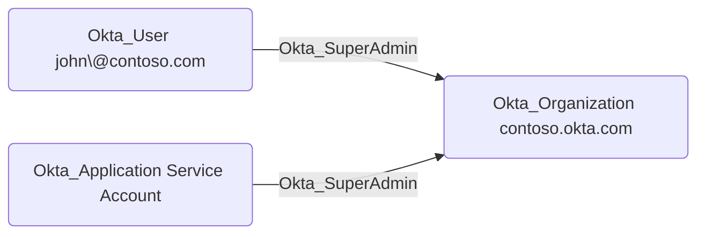

## General Information

The traversable `Okta_SuperAdmin` edges represent Super Administrator role assignments to the Okta organization. Super Administrators have full access to all features and settings in the Okta organization.

