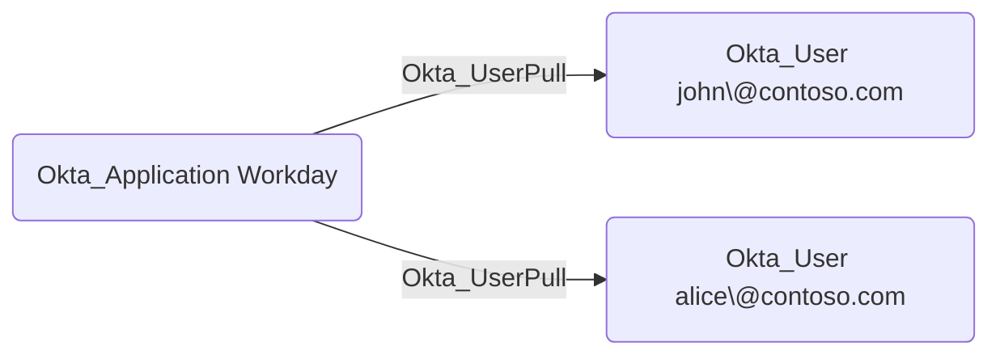

## General Information

The `Okta_UserPull` edges represent user import relationships from external applications to Okta.

```mermaid
graph LR
    app1("Okta_Application Workday")
    u1("Okta_User john\@contoso.com")
    u2("Okta_User alice\@contoso.com")
    app1 -- Okta_UserPull --> u1
    app1 -- Okta_UserPull --> u2
```
