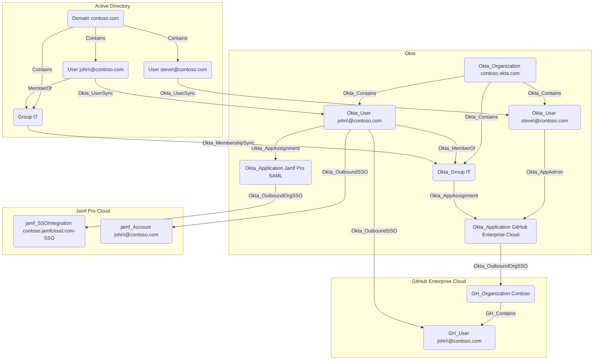

## Overview

Applications in Okta represent the various software applications and services that users can access through the Okta organization. Applications can be configured to use different authentication methods, such as SAML, OIDC, or SWA. These protocols can either be configured manually by administrators or automatically by adding an application from Okta's App Integration Catalog, which provides a wide range of pre-configured cloud and on-premises application templates.

With the exception of API Service applications, Okta users and groups can be assigned to applications. Users can also be synchronized TO and FROM applications in Okta, typically using the SCIM protocol. For example, when integrating with GitHub Enterprise Cloud, Okta can be configured to automatically create user accounts in GitHub when users are assigned to the GitHub application in Okta.

In `OktaHound`, applications are represented as `Okta_Application` nodes.

## User Name Mapping

User name mapping from Okta to SAML 2.0, OpenID Connect (OIDC), and Secure Web Authentication (SWA) applications is configurable in the Okta Admin Console, with the default setting being the Okta username pass-through, i.e., `${source.login}`.

| Application username format   | Mapping template                                            |
|-------------------------------|-------------------------------------------------------------|
| Okta username                 | `${source.login}`                                           |
| Email                         | `${source.email}`                                           |
| Okta username prefix          | `${fn:substringBefore(source.login, "@")}`                  |
| Email prefix                  | `${fn:substringBefore(source.email, "@")}`                  |
| AD Employee ID                | `${source.employeeID}`                                      |
| AD SAM account name           | `${source.samAccountName}`                                  |
| AD SAM account name + domain  | `${source.samAccountName}@${source.instance.namingContext}` |
| AD user principal name        | `${source.userName}`                                        |
| AD user principal name prefix | `${fn:substringBefore(source.userName, "@")}`               |
| (None)                        | `NONE`                                                      |
| Custom                        | ?                                                           |

## API Service Applications

This application type is the most interesting one from the security perspective, as it represents OAuth 2.0 service (daemon) applications that can be granted machine-to-machine access to Okta APIs, without any user interaction. These applications can be assigned administrative roles, e.g., Super Admin, and OAuth 2.0 scope grants, e.g., `okta.users.manage`. Any API operation must be allowed by both the assigned roles and the granted scopes.

## Hybrid Edges

For supported systems like Active Directory, GitHub Enterprise Cloud, or Jamf Pro,
OktaHound can create hybrid edges in BloodHound to represent the relationships between these external systems and Okta.

