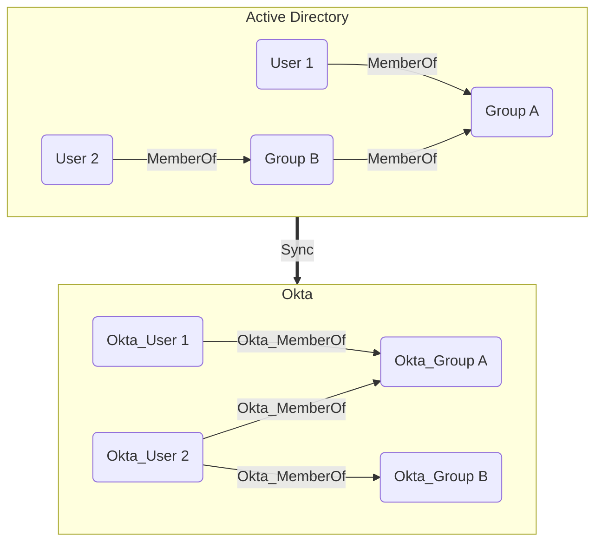

## Overview

Groups in Okta are collections of users that can be used to manage access to applications and resources. Groups can be created manually or synchronized from external directories such as Active Directory. The built-in **Everyone** group always contains all users in the Okta organization. Only users can be members of groups and groups cannot be nested.

Okta groups are represented as Okta_Group nodes.

## Synchronization with External Directories

Similarly to users, groups can also be synchronized from external directories. The Okta API exposes the original Active Directory attributes:

Nested (transitive) group memberships in Active Directory are always flattened (resolved) when synchronized to Okta, as illustrated below:

