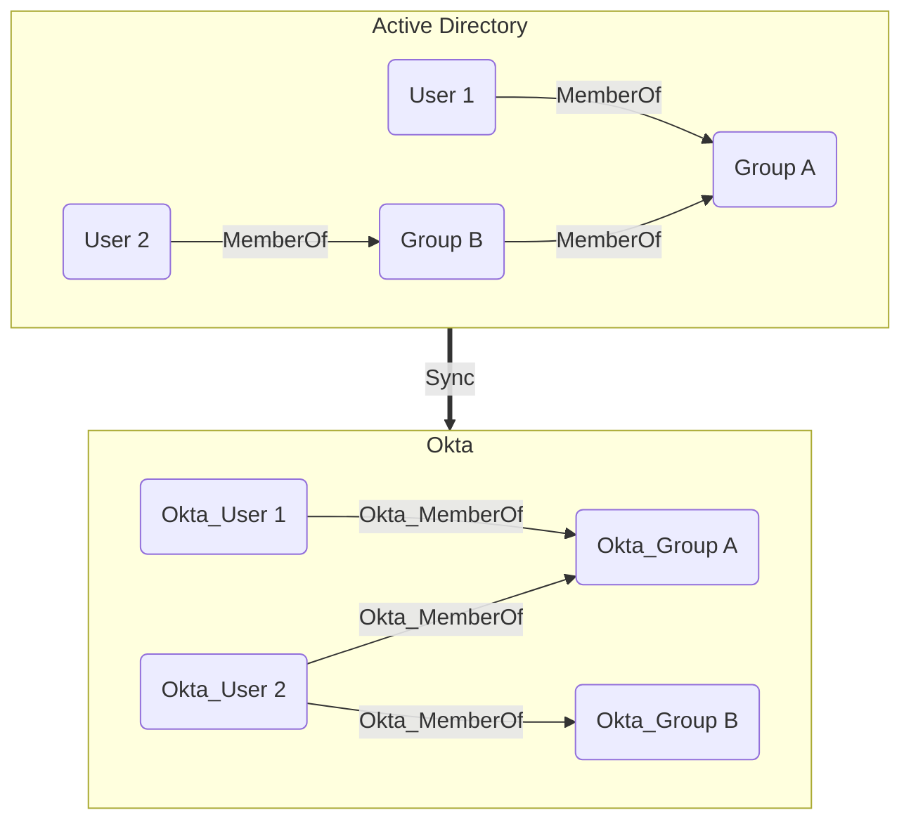

## Overview

Groups in Okta are collections of users that can be used to manage access to applications and resources. Groups can be created manually or synchronized from external directories such as Active Directory.
The built-in **Everyone** group always contains all users in the Okta organization. Only users can be members of groups and groups cannot be nested.

In `OktaHound`, groups are represented as `Okta_Group` nodes.

## Sample Property Values

Example of a group created directly in Okta:

```yaml
id: 00gxg12p4kFOkyXLb697
name: Engineering
displayName: Engineering
description: Engineering department group
oktaDomain: contoso.okta.com
hasRoleAssignments: false
oktaGroupType: OKTA_GROUP
objectClass: okta:user_group
created: 2025-11-14T08:00:25+00:00
lastUpdated: 2025-11-14T08:00:25+00:00
lastMembershipUpdated: 2025-11-14T08:00:25+00:00
```

Example of a group synchronized from Active Directory:

```yaml
id: 00gxga7s3yDJ71OzW697
name: Sales
displayName: Sales
description: Sales department group
oktaDomain: contoso.okta.com
hasRoleAssignments: false
oktaGroupType: APP_GROUP
objectClass: okta:windows_security_principal
objectSid: S-1-5-21-71365889-924527929-2677699343-2536
distinguishedName: CN=Sales,CN=Groups,DC=contoso,DC=local
samAccountName: Sales
domainQualifiedName: CONTOSO\Sales
groupScope: Global
groupType: Security
objectGuid: 4ab65ef0-ab82-4017-b5ee-1c20facd4d6a
created: 2025-11-14T12:58:13+00:00
lastUpdated: 2025-11-14T13:05:44+00:00
lastMembershipUpdated: 2025-11-14T12:58:13+00:00
```

## Synchronization with External Directories

Similarly to users, groups can also be synchronized from external directories. The Okta API exposes the original Active Directory attributes, which are then collected by `OktaHound`:


Nested (transitive) group memberships in Active Directory are always flattened (resolved) when synchronized to Okta, as illustrated below:


