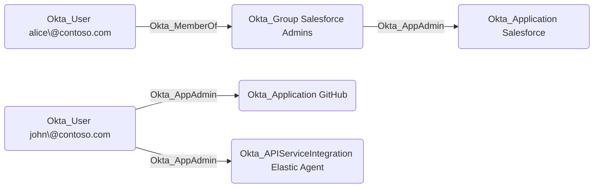

## Edge Schema

Traversable: true

## General Information

The traversable Okta_AppAdmin edges represent Application Administrator role assignments. Application Administrators can manage application configurations, user assignments, and provisioning settings for their assigned applications.

