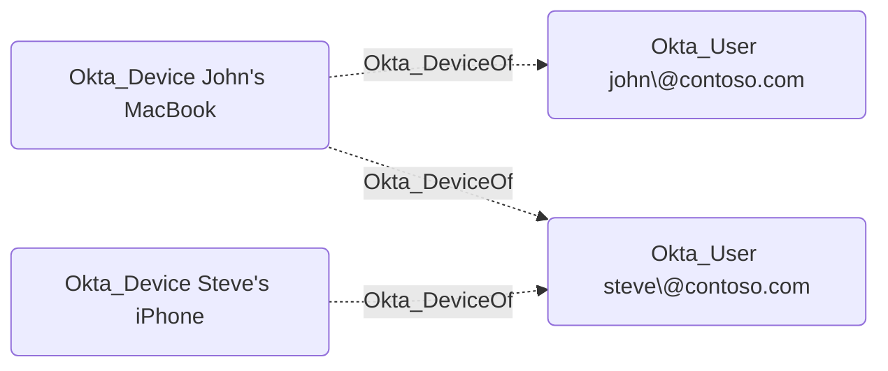

## Edge Schema

Traversable: false

## General Information

The non-traversable Okta_DeviceOf edges represent the ownership relationships between users and devices in Okta:

```mermaid
graph LR
    u1("Okta_User john\@contoso.com")
    u2("Okta_User steve\@contoso.com")
    d1("Okta_Device John's MacBook")
    d2("Okta_Device Steve's iPhone")
    d1 -. Okta_DeviceOf .-> u1
    d1 -. Okta_DeviceOf .-> u2
    d2 -. Okta_DeviceOf .-> u2
```
