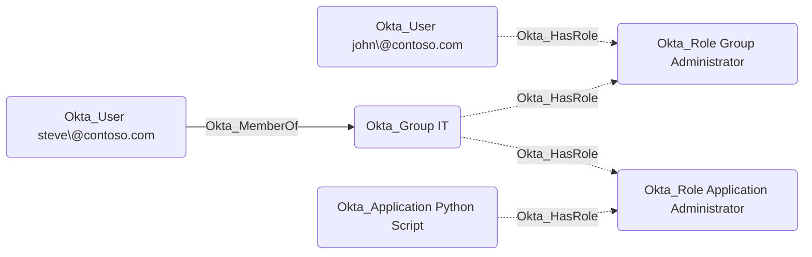

## Edge Schema

Traversable: false

## General Information

The non-traversable Okta_HasRole edges represent the role assignments for users in Okta:

```mermaid
graph LR
    u1("Okta_User john\@contoso.com")
    u2("Okta_User steve\@contoso.com")
    g1("Okta_Group IT")
    a1("Okta_Application Python Script")
    r1("Okta_Role Group Administrator")
    r2("Okta_Role Application Administrator")
    u1 -. Okta_HasRole .-> r1
    g1 -. Okta_HasRole .-> r1
    g1 -. Okta_HasRole .-> r2
    a1 -. Okta_HasRole .-> r2
    u2 -- Okta_MemberOf --> g1
```
