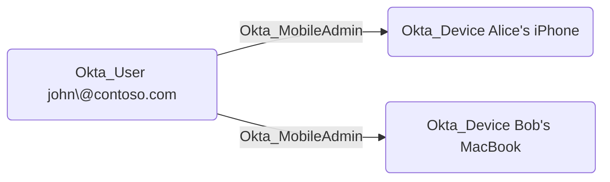

## Edge Schema

Traversable: true

## General Information

The traversable Okta_MobileAdmin edges represent Mobile Administrator role assignments. Mobile Administrators can manage mobile device settings and configurations within their assigned scope.

