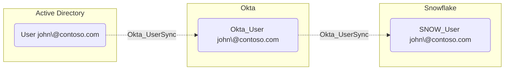

## Edge Schema

Traversable: false

## General Information

The non-traversable hybrid Okta_UserSync edges represent bidirectional user synchronization relationships between Okta and external directories or applications. These edges indicate that user accounts are linked and synchronized between systems.

